# Total synthesis of Escherichia coli with a recoded genome

Julius Fredens1,4, Kaihang Wang1,2,4, Daniel de la Torre1,4, Louise F. H. Funke1,4, Wesley E. Robertson1,4, Yonka Christova1 , Tiongsun Chia1 , Wolfgang H. Schmied1 , Daniel L. Dunkelmann1 , Václav Beránek1 , Chayasith Uttamapinant1,3, Andres Gonzalez Llamazares1 , Thomas S. Elliott1 & Jason W. Chin1 \*

Nature uses 64 codons to encode the synthesis of proteins from the genome, and chooses 1 sense codon—out of up to 6 synonyms—to encode each amino acid. Synonymous codon choice has diverse and important roles, and many synonymous substitutions are detrimental. Here we demonstrate that the number of codons used to encode the canonical amino acids can be reduced, through the genome-wide substitution of target codons by defined synonyms. We create a variant of Escherichia coli with a four-megabase synthetic genome through a high-fidelity convergent total synthesis. Our synthetic genome implements a defined recoding and refactoring scheme—with simple corrections at just seven positions—to replace every known occurrence of two sense codons and a stop codon in the genome. Thus, we recode 18,214 codons to create an organism with a 61-codon genome; this organism uses 59 codons to encode the 20 amino acids, and enables the deletion of a previously essential transfer RNA.

Nature uses 64 triplet codons to encode the synthesis of proteins that are composed of the canonical 20 amino acids; 18 of these amino acids are encoded by more than 1 synonymous codon1 . Synonymous codon choice can influence mRNA folding2 , gene expression3–6 , co-translational folding and protein levels2,7,8 , and has emerging roles9,10. In addition, synonymous codons may have different roles at different positions in the genome11.

Reducing the number of sense codons used to encode the canonical amino acids—through genome-wide replacement of a target codon with synonymous codons (which we term synonymous codon compression)—would address whether all synonymous codons are necessary, and may also provide a foundation for the in vivo biosynthesis of genetically encoded non-canonical biopolymers12.

Up to 321 amber stop codons have been removed from the E. coli genome, using site-directed mutagenesis approaches that commonly introduce large numbers of off-target mutations13–15. Sense codons are commonly more abundant than stop codons by several orders of magnitude, and—in principle—high-fidelity genome synthesis would be the preferred route for tackling their removal. Efforts to alter synonymous codons in individual genes16, genomic regions and essential operons9,16–21 have provided insight into synonymous codon choice, and a subset of these studies have attempted to alter synonymous codons in ways that are consistent with synonymous codon compression17–19,21. However, these previous studies have mutated only a small fraction of targeted sense codons in the genome of a single strain.

There are an extremely large number of theoretical genomes that are formally compatible with synonymous codon compression $\cdot ^ { n ^ { p } }$ , in which $n$ is the number of synonyms for a target codon $n = 2 – 6$ and $P$ is the number of target-codon positions $\check { P } = 1 0 ^ { 3 }$ to $1 0 ^ { 5 } )$ ), and it is not possible to experimentally test the viability of $n ^ { p }$ genomes. Defined synonymous codons have previously been used17 to replace the target codons in a 20-kb region of the $E _ { \ast }$ coli genome that is rich in both essential genes and target codons; these studies identified simple defined ‘recoding schemes’ that permit synonymous codon compression in this region17. However, it remained unclear whether these schemes could be applied for genome-wide recoding.

DNA synthesis and assembly methods enabled the creation of a Mycoplasma mycoides with a 1.08-Mb synthetic genome22,23, and the creation of 9 strains of Saccharomyces cerevisiae in which 1 or 2 of the 16 chromosomes is replaced by synthetic $\mathrm { D N A } ^ { 2 4 - 3 1 }$ (up to $0 . 9 9 \mathrm { M b }$ $8 \%$ of the yeast genome). Replicon excision for enhanced genome engineering through programmed recombination (REXER)—an approach for replacing more than $1 0 0 \mathrm { k b }$ of the E. coli genome with synthetic DNA in a single step—has recently been reported17, and it has been demonstrated that REXER can be iterated via genome stepwise interchange synthesis (GENESIS)17. Here we implement a convergent total synthesis to replace the 4-Mb E. coli MDS42 (ref. 32) genome with a synthetic genome. The synthetic genome is refactored33 and recoded for the genome-wide removal of two sense codons and a stop codon, which creates a synthetic E. coli that uses 61 codons for protein synthesis.

# Design of a recoded genome

We designed a genome in which the serine codons TCG and TCA, and the stop codon TAG, in open reading frames (ORFs) of MDS42 E. coli (Supplementary Data 1) are systematically replaced by their synonyms AGC, AGT and TAA, respectively (Fig. 1a, Supplementary Data 2, 3). It has previously been shown that this defined recoding scheme is allowed in a 20-kb region of the genome17.

Many target codons are found in areas of overlap between ORFs. We classified these overlaps as $3 ^ { \prime }$ , $3 ^ { \prime }$ (between ORFs in opposite orientations) or $5 ^ { \prime } , 3 ^ { \prime }$ (between ORFs in the same orientation). When the recoding of a $3 ^ { \prime }$ , $3 ^ { \prime }$ overlap could be achieved without changing the encoded protein sequences, the structure of the overlap was maintained and the sequences were directly recoded. Otherwise, we duplicated the overlap and individually recoded each ORF (Fig. 1b, Supplementary Data 4). For $5 ^ { \prime }$ , $3 ^ { \prime }$ overlaps, we separated the ORFs by duplicating both the overlap between the ORFs and the 20-bp sequence upstream of the overlap, which enabled independent recoding of each ORF (Fig. 1c, Supplementary Data 4). Using the defined rules for synonymous

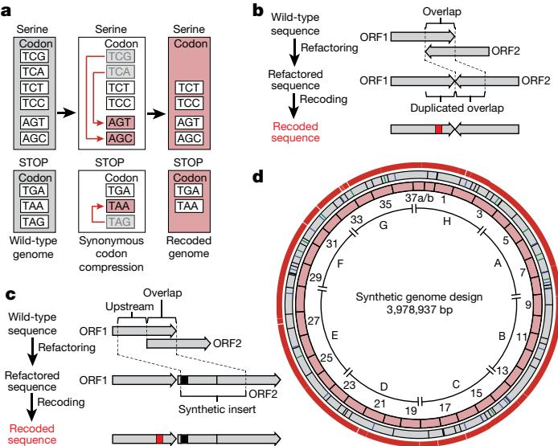

Fig. 1 | Design of the synthetic genome, implementing a defined recoding scheme for synonymous codon compression. a, The defined recoding scheme for synonymous codon compression. Synonymous serine codons and three stop codons used in the genome of wild-type E. coli are shown (grey boxes). Systematically implementing a defined recoding scheme for synonymous codon compression (red arrows) recodes target codons to defined synonyms, and replaces the amber stop codon TAG with the ochre stop codon TAA. This creates an organism with a recoded genome that uses a reduced number of serine and termination codons (pink boxes). b, Refactoring of $3 ^ { \prime }$ , $3 ^ { \prime }$ overlaps enables their independent recoding. The overlap between two ORFs (ORF1 and ORF2) is duplicated, which enables independent recoding (red box) of these ORFs. c, Refactoring $5 ^ { \prime }$ , $3 ^ { \prime }$ overlaps. The overlap plus 20 bp upstream is duplicated to generate a synthetic insert. When the overlap is longer than 1 bp at the end of the upstream ORF, an in-frame TAA (black box) is introduced in the beginning of the synthetic insert; this in-frame stop codon ensures the termination of translation from the original ribosome-binding site. Thus, all full-length translation of the downstream ORF is initiated from the reconstructed ribosome-binding site in the synthetic insert. This refactoring enables the independent recoding (red box) of ORFs. d, Map of the synthetic genome design with all TCG, TCA and TAG codons removed. Outer ring shows positions (18,218 red bars) of all TCG to AGC, TCA to AGT and TAG to TAA recodings. Grey ring shows positions of designed silent mutations in overlaps (12 green bars), refactoring of $3 ^ { \prime }$ , $3 ^ { \prime }$ overlaps (schematic shown in b, 21 blue bars) and refactoring of $5 ^ { \prime }$ , $3 ^ { \prime }$ overlapping regions (schematic shown in c, 58 black bars). Pink ring shows 37 fragments of approximately $1 0 0 \mathrm { k b }$ in size each. Fragment 37 is shown as 37a and 37b to reflect the final assembly. The sections A to H are indicated.

codon compression and refactoring, we designed a genome in which all 18,218 target codons are recoded to their target synonyms (Fig. 1d, Supplementary Data 3).

# Synthesis of recoded sections

We performed a retrosynthesis—analogous to that commonly used for designing synthetic routes in chemistry34—on the designed genome (Fig. 2). We disconnected the genome into eight sections, each of approximately $0 . 5 \mathrm { M b }$ in length, which were labelled A to H (Figs. 1d, 2a, Supplementary Data 2); we then disconnected each section into 4 or 5 fragments (Fig. 2b). This yielded 37 fragments (Fig. 1d, Supplementary Data 2) that were between $9 1 \mathrm { k b }$ and $1 3 6 \mathrm { k b }$ in length. We placed the boundaries between fragments or sections in intergenic regions that are between non-essential genes. The fragments were further disconnected into 9–14 stretches that were approximately $1 0 \mathrm { k b }$ in length (Fig. 2c, Supplementary Data 5).

We assembled bacterial artificial chromosomes (BACs) for REXER (Fig. 2c, Supplementary Data 6–9) that contained each fragment, using homologous recombination in S. cerevisiae17,35. For 36 of the fragments, BAC assembly proceeded smoothly (Supplementary Data 10). Fragment 37 was challenging to assemble and we therefore split it into

Fig. 2 | Retrosynthesis of the synthetic genome. a, Disconnecting the genome into eight sections. The synthetic genome was disconnected into sections A to H, with each section corresponding to approximately $0 . 5 \mathrm { M b }$ (step 1). The position of the replication origin oriC (orange square) is indicated. Sections were assembled into a completely recoded genome (in the forward sense, opposite to the direction of the retrosynthesis arrow) by directed conjugation (Fig. 3, Extended Data Fig. 7). b, Disconnecting genome sections into 100-kb fragments. Sections are further disconnected into 4 or 5 fragments of around $1 0 0 \mathrm { k b }$ in length each. Section A is depicted, and other sections were treated similarly. Nearly all sections were constructed entirely through consecutive REXER steps, by GENESIS (Extended Data Fig. 1). Each step replaced around $1 0 0 \mathrm { k b }$ of wild-type genomic sequence with $1 0 0 \mathrm { k b }$ of synthetic fragment (steps 2 and 3). c, Disconnecting each 100-kb synthetic fragment into 10-kb synthetic stretches. Each 100-kb synthetic fragment is further disconnected into 9 to 14 short synthetic stretches of around $1 0 \mathrm { k b }$ in length (step 4). The BACs that carry 100-kb synthetic fragments (pink) were assembled by homologous recombination in yeast. Each BAC contains Cas9 cleavage sites (black triangles) that enable excision of the synthetic DNA in vivo, homology regions 1 and 2 (HR1 and HR2) for targeting recombination, and the appropriate double-selection cassette. The $^ { - 2 }$ (sucrose sensitivity, encoded by sacB), $^ { + 2 }$ (chloramphenicol resistance, encoded by cat) double selection cassette is indicated. However different double selection cassettes are used for selection in different steps of REXER. A negative-selection marker $( r p s L ;$ indicated as $- 1$ ) is used to enable loss of the backbone after REXER. BAC and yeast artificial chromosome (YAC) origins and a URA3 marker, all for maintenance in E. coli and S. cerevisiae, are indicated.

two 50-kb fragments (labelled 37a and $3 7 \mathrm { b }$ ), which were straightforward to assemble (Supplementary Data 10).

We initiated genome replacement in seven distinct strains using REXER (Extended Data Fig. 1a). The start point for REXER in each strain corresponds to the beginning of sections A, C, D, E, F, G or H (Figs. 1d, 2a); section B was subsequently built on section A. In each strain, the positive and negative selection markers that are introduced in the first REXER provide a template for the next round of REXER, which enables GENESIS17 (Fig. 2b, Extended Data Fig. 1b). We found that REXER could be initiated by the electroporation of linear double-stranded spacers generated by PCR (Supplementary Data 11–13) rather than plasmid-encoded spacers17, which accelerated GENESIS. For sections A, C, D, E, F and G, we proceeded with GENESIS in a clockwise direction for 4 or 5 steps of REXER and replaced approximately $0 . 5 \mathrm { M b }$ of genomic DNA with synthetic DNA. We sequenced the genomes of cells after each step of REXER and identified clones that were fully recoded over the targeted genomic region (Supplementary Data 11). Section A was completed first, and we therefore proceeded with GENESIS through section B in a strain that contained recoded section A.

We carried out numerous single-step REXERs with individual fragments (Supplementary Data 11), in parallel with GENESIS, to accelerate the identification of genomic regions that may be challenging to recode. For 35 steps, including all of sections A, C, D, E, F and G, we completely recoded the targeted genomic sequence by GENESIS. However, we observed incomplete replacement of the corresponding genomic region by synthetic DNA for fragment 9 (in section B), and for fragments 37a and 1 (in section H) (Supplementary Data 11).

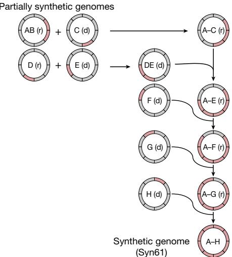  
Fig. 3 | Assembly of recoded genome sections to create Syn61. Synthetic genomic sections (pink) from multiple individual partially recoded genomes were assembled into a single fully recoded genome in the indicated sequence of conjugations. The donor (d) and recipient (r) strains contain unique recoded genomic sections, denoted in pink. The recoded genomic content from the donor was conjugated in a clockwise manner to replace the corresponding wild-type genomic section (grey) in the recipient. Conjugation proceeded until the final fully recoded A to H strain (that is, Syn61) was assembled. Extended Data Figure 7 shows the process in more detail, including all homology regions.

# Identifying and repairing design flaws

Sequencing several clones following REXER enabled us to score the frequency with which each target codon is recoded, and thereby to compile a recoding landscape for the genomic region17. From the recoding landscape with fragment 1, we identified the fourth codon (TCA, Ser4) in map, which is an essential gene that encodes methionine amino peptidase, as recalcitrant to recoding by our defined scheme (Extended Data Fig. 2). We also identified a second region—which encompasses a 14-bp overlap of the essential genes ftsI and murE, and several serine codons in ftsI and murE—that was not replaced by our recoded and refactored sequence. As this region has previously been recoded with the same recoding scheme, duplicating the overlap plus 182 bp rather than the 20 bp used in our synthetic genome design17 (Fig. 1c), the defect in the synthetic DNA for this region is in its refactoring. REXER using a new fragment-1 BAC—which contained both the extended refactoring (Extended Data Fig. 2) and a TCA-to-TCT mutation at Ser4 in map (Extended Data Fig. 2, Supplementary Data 14)— enabled complete recoding of the targeted 100-kb region of the genome (Extended Data Fig. 2).

From the post-REXER recoding landscape of fragment 9 and additional experiments, we identified five target codons within yceQ as being problematic to recode (Extended Data Fig. 3). Similarly, we identified a single codon at the $3 ^ { \prime }$ end of yaaY in fragment 37a, which was never recoded (Extended Data Fig. 4). yceQ and yaaY both encode ‘predicted proteins’, multiple insertions in yceQ are viable36 and there are no reports in the Universal Protein Resource (UniProt) of mRNA production and/or protein synthesis from these predicted genes37. Notably, the codons that are recalcitrant to recoding within yceQ and yaaY all lie within the $5 ^ { \prime }$ untranslated regions of adjacent essential genes, and altering these sequences probably has negative effects on the regulation of these essential genes. Indeed, the target codons in yceQ map to RNA secondary structures and promoter elements within the $5 ^ { \prime }$ untranslated region of rne (which encodes the essential RNase, RNase E)38–41 (Extended Data Fig. 5), and these sequences are essential for controlling RNase E homeostasis41.

We fixed fragment 9 by introducing a stop codon into the $5 ^ { \prime }$ sequence of yceQ, thus minimizing translation but retaining native sequences for regulating rne transcription (Extended Data Fig. 3, Supplementary Data 14). REXER using this new BAC led to a complete recoding of the corresponding genomic region (Extended Data Fig. 3, Supplementary Data 11). REXER using a new BAC that contained fragment 37a with a TCA-to-AGC substitution at the problematic codon in yaaY led to a complete recoding of the corresponding region of the genome (Extended Data Fig. 4, Supplementary Data 14).

Having pinpointed and fixed all the initially problematic sequences, we completed the assembly of a strain in which sections A and B are fully recoded (Extended Data Fig. 6), and the assembly of a strain in which section $_ \mathrm { H }$ is entirely recoded (Extended Data Fig. 6, Supplementary Data 11). This completed the assembly of all the sections in seven distinct strains.

# Assembly of a recoded genome

We developed a conjugation-based strategy42–44 to assemble the recoded sections into a single genome (Fig. 3). Our strategy assembles the recoded genome in a clockwise manner, by conjugating recoded ‘donor’ sections that contain the origin of transfer (oriT), into adjacent recoded ‘recipient’ sections that have been extended to provide homology to the donor (Extended Data Fig. 7, Supplementary Data 15, 16). Following conjugation between the donor and the recipient cells, we selected for recipient cells; we then selected for those recipients that had gained the positive marker at the end of the recoded sequence from the donor and lost the negative marker at the end of the extension in the recipient (Extended Data Fig. 7).

The resulting cells, which contain the recoded sections of both the donor and the recipient, can then be used as a recipient for the next recoded donor, and iteration of the process enables the recoded genome to be assembled through the addition of recoded sections to an increasingly recoded recipient (Fig. 3, Extended Data Fig. 7). Donor cells contained a version of the $\mathrm { F ^ { \prime } }$ plasmid that facilitates transfer of the donor genome to the recipient cells, but which is not competent to transfer itself to recipient cells (Supplementary Data 17). As a result, this $\mathrm { F ^ { \prime } }$ plasmid does not have to be lost from the recipient cells after every conjugation; this accelerated our workflow.

Conjugative assembly (Fig. 3, Extended Data Fig. 7) enabled the synthesis of a synthetic E. coli that we named ‘Syn61’, in which all $1 . 8 \times \mathrm { { \dot { 1 } } 0 ^ { 4 } }$ target codons in the genome are recoded (Supplementary Data 18). The synthesis introduced only 8 non-programmed mutations, and none of these non-programmed mutations affects recoding (Supplementary Data 19); 4 of these mutations arose during the preparation of the 100-kb BACs, and 4 arose during the recoding process.

# Properties of Syn61

Syn61 doubled only $1 . 6 \times$ slower than MDS42 in lysogeny broth (LB) plus glucose at ${ 3 7 ^ { \circ } } \mathrm { C } ,$ and this ratio increased at $2 5 ^ { \circ } \mathrm { C }$ and decreased at $4 2 ^ { \circ } \mathrm { C }$ (Extended Data Fig. 8a). Syn61 contains $6 5 \%$ more AGT and AGC codons than are present in MDS42; however, providing additional copies of serV—the transfer RNA (tRNA) that decodes these codons (Fig. 4a)—did not increase growth (Extended Data Fig. 8a). This suggests serV is not limiting. Imaging Syn61 cells suggests that they are slightly longer than MDS42 (Extended Data Fig. 8b, c). We observed minimal differences in the proteomes quantified in both Syn61 and MDS42 (Extended Data Fig. 8d, Supplementary Data 20). Co-translational incorporation of a non-canonical amino acid, using an orthogonal aminoacyl-tRNA synthetase/tRNACGA pair45–47 targeted to TCG codons, was extremely toxic in MDS42 but non-toxic in Syn61; this validates the removal of TCG codons in Syn61 (Fig. 4b). This approach also provided additional insights (Extended Data Fig. 9a–c). serT encodes the tRNASerUGA, which is the only tRNA predicted to decode TCA codons in E. coli and is therefore essential48. Because Syn61 does not contain TCA codons, serT is dispensable in this strain (Fig. 4c, Extended Data Fig. 9d, Supplementary Data 21), as expected. serU and prfA could also be deleted in Syn61 (Extended Data Fig. 9e, f, Supplementary Data 21). These data provide functional confirmation that we have removed the target codons from the genome, show that the cognate tRNAs and release factor can be removed in Syn61, and demonstrate the unique properties of Syn61 that arise from recoding.

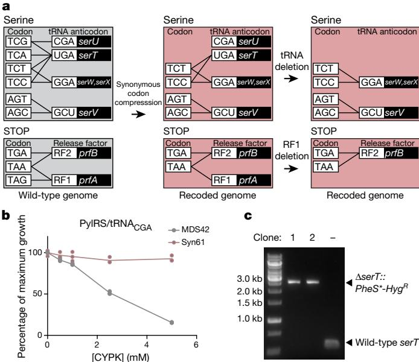

Fig. 4 | Functional consequences of synonymous codon compression in Syn61. a, Synonymous codon compression and deletion of prfA, serU and serT. The grey boxes show the serine codons and stop codons, together with the tRNAs and release factors that decode them in wild-type E. coli (wild-type genome). tRNA anticodons and release factors are connected to the codons that they are predicted to read by black lines. The tRNA and release factor genes are shown in the black boxes. Synonymous codon compression leads to a recoded genome (pink boxes), in which tRNAs with CGA anticodons should have no cognate codons and serT should be dispensable. All factors that read the target codons should be dispensable in Syn61. b, Co-translational incorporation of the non-canonical amino acid $N \varepsilon$ -(((2-methylcycloprop-2-en-1-yl) methoxy) carbonyl)- $\mathbf { \nabla } \cdot \mathbf { L }$ -lysine (CYPK), using the orthogonal Methanosarcina mazei pyrrolysyl-tRNA synthetase $( \mathrm { P y l R S } ) / \mathrm { t R N A } ^ { \mathrm { P y l } } \mathrm { _ { C G A } }$ pair, was toxic in MDS42, but not in Syn61. When provided with CYPK, this pair will incorporate the noncanonical amino acid in response to TCG codons in a dose-dependent manner. In MDS42 (grey), this incorporation leads to mis-synthesis of the proteome, and toxicity. In Syn61 (pink) (which does not contain TCG codons), this is non-toxic. The lines follow the mean of three biological replicates (each shown as a dot) at each CYPK concentration $\mathrm { ~ \textit ~ { ~ O ~ m M } ~ }$ , $0 . 5 \mathrm { m M }$ , $1 \mathrm { m M }$ , $2 . 5 \mathrm { m M }$ and $5 \mathrm { m M }$ ). Percentage of maximum growth was determined by the final optical density at $6 0 0 \mathrm { n m }$ (cid:) $\mathrm { \prime O D } _ { 6 0 0 } \mathrm { \prime }$ ) with the indicated concentration of CYPK divided by the final $\mathrm { O D } _ { 6 0 0 }$ in the absence of CYPK. Final $\mathrm { O D } _ { 6 0 0 }$ values were determined after $6 0 0 \mathrm { { m i n } }$ . c, Synonymous codon compression enables deletion of serT in Syn61. PCR flanking the serT locus before $( - )$ and after (clones 1 and 2) replacement with a $\check { P h e S * } { - } H y g ^ { R }$ double selection cassette; $H y g ^ { R }$ denotes hygromycin resistance (aph(4)-Ia), $P h e S *$ denotes a mutant of PheS that encodes a Thr251Ala, Ala294Gly mutant of phenylalanyl-tRNA synthetase. The experiment was performed once. See Extended Data Fig. 9. Full gels are in Supplementary Fig. 1.

# Discussion

We have created $E$ . coli in which the entire 4-Mb genome is replaced with synthetic DNA; to our knowledge, the scale of genomic replacement in Syn61 is approximately $4 \times$ larger than previously reported for genome or chromosome replacement in any organism (Extended Data Fig. 10a).

We have demonstrated the genome-wide removal of all $1 . 8 \times 1 0 ^ { 4 }$ target codons, and thereby removed orders-of-magnitude more codons than previous efforts (Extended Data Fig. 10b). Our synthetic genome contains only $2 \times 1 0 ^ { - 4 }$ non-programmed mutations per target codon (Extended Data Fig. 10c), which is orders-of-magnitude lower than the non-programmed mutation frequency in previous recoding efforts14 (Extended Data Fig. 10c).

The creation of an organism that uses a reduced number of sense codons (59) to encode the 20 canonical amino acids demonstrates that life can operate with a reduced number of synonymous sense codons.

Our final synthetic genome was recoded using defined refactoring and recoding schemes, and a recoding rule that was previously determined on just 83 $( 0 . 4 3 \% )$ of the target codons in the genome17. There are a vast number of theoretical recoding schemes and previous work has established that not all recoding schemes are viable16–20; it is therefore notable that it is possible to identify a single defined recoding scheme that—with a small number of simple corrections—allows genome-wide synonymous codon compression.

The strategies that we have developed for disconnecting a designed genome into sections, fragments and stretches, and realizing the design through the convergent, seamless and robust integration of REXER, GENESIS and directed conjugation, provides a blueprint for future genome syntheses. In future work, we will further characterize the consequences of synonymous codon compression in Syn61 and investigate additional recoding schemes. In addition, we will investigate the extent to which our approach enables sense-codon reassignment for non-canonical biopolymer synthesis12.

# Reporting summary

Further information on research design is available in the Nature Research Reporting Summary linked to this paper.

# Data availability

The sequences and genome design details used in this study are available in the Supplementary Data. Supplementary Data 1 provides the GenBank file of the E. coli MDS42 genome (NCBI accession number AP012306.1); Supplementary Data 2 provides the GenBank file of the designed synthetic E. coli genome with codon replacements and refactorings; Supplementary Data 3 provides the table of target codons; Supplementary Data 4 provides the table of overlaps and refactoring; Supplementary Data 5 provides the table of $1 0 { \cdot } \mathrm { k b }$ stretches; Supplementary Data 6 provides the GenBank file of the BAC sacB-cat-rpsL; Supplementary Data 7 provides the GenBank file of BAC-rpsL-kanR-sacB; Supplementary Data 8 provides the GenBank file of the BAC rpsL-kanR-pheS∗-HygR; Supplementary Data 9 provides the table of BAC construction; Supplementary Data 10 provides the table of BAC assembly; Supplementary Data 11 provides the table of REXER experiments; Supplementary Data 12 provides the GenBank file of spacer plasmids without trans-activating CRISPR RNA (tracrRNA) and annotation for linear spacers; Supplementary Data 13 provides the GenBank file of spacer plasmids with tracrRNA and annotation for linear spacers; Supplementary Data 14 provides the table of oligonucleotides used for recoding fixing experiments; Supplementary Data 15 provides the GenBank file of the gentamycin-resistance oriT cassette; Supplementary Data 16 provides the oligonucleotide primers used for conjugation; Supplementary Data 17 provides the GenBank file of the pJF146 $\mathrm { F ^ { \prime } }$ plasmid that does not self-transfer; Supplementary Data 18 provides the GenBank file of the fully recoded genome of Syn61, verified by next-generation sequencing; Supplementary Data 19 provides the table of design optimizations and non-programmed mutations; Supplementary Data 20 provides a list of the proteins identified by tandem mass spectrometry; and Supplementary Data 21 provides a list of the primers used for deletion experiments. All other datasets generated and/or analysed in this study are available from the corresponding author upon reasonable request. All materials (Supplementary Data 9, 12, 13, 17, 18) from this study are available from the corresponding author upon reasonable request.

# Code availability

Code used for genome design is available at https://github.com/TiongSun/genome_ recoding; for sequencing at https://github.com/TiongSun/iSeq; and for generating recoding landscapes at https://github.com/TiongSun/recoding_landscape.

Received: 18 December 2018; Accepted: 9 April 2019;   
Published online 15 May 2019.   
6. Curran, J. F. & Yarus, M. Rates of aminoacyl-tRNA selection at 29 sense codons in vivo. J. Mol. Biol. 209, 65–77 (1989).   
7. Kimchi-Sarfaty, C. et al. A “silent” polymorphism in the MDR1 gene changes substrate specifcity. Science 315, 525–528 (2007).   
8. Zhang, G., Hubalewska, M. & Ignatova, Z. Transient ribosomal attenuation coordinates protein synthesis and co-translational folding. Nat. Struct. Mol. Biol. 16, 274–280 (2009).   
9. Mittal, P., Brindle, J., Stephen, J., Plotkin, J. B. & Kudla, G. Codon usage infuences ftness through RNA toxicity. Proc. Natl Acad. Sci. USA 115, 8639–8644 (2018).   
10. Cambray, G., Guimaraes, J. C. & Arkin, A. P. Evaluation of 244,000 synthetic sequences reveals design principles to optimize translation in Escherichia coli. Nat. Biotechnol. 36, 1005–1015 (2018).   
11. Quax, T. E., Claassens, N. J., Söll, D. & van der Oost, J. Codon bias as a means to fne-tune gene expression. Mol. Cell 59, 149–161 (2015).   
12. Chin, J. W. Expanding and reprogramming the genetic code. Nature 550, 53–60 (2017).   
13. Mukai, T. et al. Codon reassignment in the Escherichia coli genetic code. Nucleic Acids Res. 38, 8188–8195 (2010).   
14. Lajoie, M. J. et al. Genomically recoded organisms expand biological functions. Science 342, 357–360 (2013).   
15. Mukai, T. et al. Highly reproductive Escherichia coli cells with no specifc assignment to the UAG codon. Sci. Rep. 5, 9699 (2015).   
16. Napolitano, M. G. et al. Emergent rules for codon choice elucidated by editing rare arginine codons in Escherichia coli. Proc. Natl Acad. Sci. USA 113, E5588–E5597 (2016).   
17. Wang, K. et al. Defning synonymous codon compression schemes by genome recoding. Nature 539, 59–64 (2016).   
18. Lau, Y. H. et al. Large-scale recoding of a bacterial genome by iterative recombineering of synthetic DNA. Nucleic Acids Res. 45, 6971–6980 (2017).   
19. Ostrov, N. et al. Design, synthesis, and testing toward a 57-codon genome. Science 353, 819–822 (2016).   
20. Mukai, T. et al. Reassignment of a rare sense codon to a non-canonical amino acid in Escherichia coli. Nucleic Acids Res. 43, 8111–8122 (2015).   
21. Hutchison, C. A. III et al. Design and synthesis of a minimal bacterial genome. Science 351, aad6253 (2016).   
22. Gibson, D. G. et al. Complete chemical synthesis, assembly, and cloning of a Mycoplasma genitalium genome. Science 319, 1215–1220 (2008).   
23. Gibson, D. G. et al. Creation of a bacterial cell controlled by a chemically synthesized genome. Science 329, 52–56 (2010).   
24. Shen, Y. et al. Deep functional analysis of synII, a 770-kilobase synthetic yeast chromosome. Science 355, eaaf4791 (2017).   
25. Annaluru, N. et al. Total synthesis of a functional designer eukaryotic chromosome. Science 344, 55–58 (2014).   
26. Xie, Z. X. et al. “Perfect” designer chromosome V and behavior of a ring derivative. Science 355, eaaf4704 (2017).   
27. Mitchell, L. A. et al. Synthesis, debugging, and efects of synthetic chromosome consolidation: synVI and beyond. Science 355, eaaf4831 (2017).   
28. Dymond, J. S. et al. Synthetic chromosome arms function in yeast and generate phenotypic diversity by design. Nature 477, 471–476 (2011).   
29. Wu, Y. et al. Bug mapping and ftness testing of chemically synthesized chromosome X. Science 355, eaaf4706 (2017).   
30. Zhang, W. et al. Engineering the ribosomal DNA in a megabase synthetic chromosome. Science 355, eaaf3981 (2017).   
31. Richardson, S. M. et al. Design of a synthetic yeast genome. Science 355, 1040–1044 (2017).   
32. Pósfai, G. et al. Emergent properties of reduced-genome Escherichia coli. Science 312, 1044–1046 (2006).   
33. Chan, L. Y., Kosuri, S. & Endy, D. Refactoring bacteriophage T7. Mol. Syst. Biol. 1, 2005.0018 (2005).   
34. Corey, E. J. & Cheng, X.-M. The Logic of Chemical Synthesis (John Wiley, Chichester, 1989).   
35. Kouprina, N., Noskov, V. N., Koriabine, M., Leem, S. H. & Larionov, V. Exploring transformation-associated recombination cloning for selective isolation of genomic regions. Methods Mol. Biol. 255, 69–89 (2004).   
36. Goodall, E. C. A. et al. The essential genome of Escherichia coli K-12. MBio 9, e02096-17 (2018).   
37. Pundir, S., Martin, M. J. & O’Donovan, C. UniProt Protein Knowledgebase. Methods Mol. Biol. 1558, 41–55 (2017).   
38. Claverie-Martin, F., Diaz-Torres, M. R., Yancey, S. D. & Kushner, S. R. Analysis of the altered mRNA stability (ams) gene from Escherichia coli. Nucleotide sequence, transcriptional analysis, and homology of its product to MRP3, a mitochondrial ribosomal protein from Neurospora crassa. J. Biol. Chem. 266, 2843–2851 (1991).   
39. Jain, C. & Belasco, J. G. RNase E autoregulates its synthesis by controlling the degradation rate of its own mRNA in Escherichia coli: unusual sensitivity of the rne transcript to RNase E activity. Genes Dev. 9, 84–96 (1995).   
40. Diwa, A., Bricker, A. L., Jain, C. & Belasco, J. G. An evolutionarily conserved RNA stem-loop functions as a sensor that directs feedback regulation of RNase E gene expression. Genes Dev. 14, 1249–1260 (2000).   
41. Schuck, A., Diwa, A. & Belasco, J. G. RNase E autoregulates its synthesis in Escherichia coli by binding directly to a stem-loop in the rne $5 ^ { \prime }$ untranslated region. Mol. Microbiol. 72, 470–478 (2009).   
42. Isaacs, F. J. et al. Precise manipulation of chromosomes in vivo enables genome-wide codon replacement. Science 333, 348–353 (2011).   
43. Ma, N. J., Moonan, D. W. & Isaacs, F. J. Precise manipulation of bacterial chromosomes by conjugative assembly genome engineering. Nat. Protocols 9, 2285–2300 (2014).   
44. Lederberg, J. & Tatum, E. L. Gene recombination in Escherichia coli. Nature 158, 558 (1946).   
45. Elliott, T. S., Bianco, A., Townsley, F. M., Fried, S. D. & Chin, J. W. Tagging and enriching proteins enables cell-specifc proteomics. Cell Chem. Biol. 23, 805–815 (2016).   
46. Elliott, T. S. et al. Proteome labeling and protein identifcation in specifc tissues and at specifc developmental stages in an animal. Nat. Biotechnol. 32, 465–472 (2014).   
47. Krogager, T. P. et al. Labeling and identifying cell-specifc proteomes in the mouse brain. Nat. Biotechnol. 36, 156–159 (2018).   
48. Neidhardt, F. C. Escherichia coli and Salmonella typhimurium: Cellular and Molecular Biology (American Society for Microbiology, Washington, 1987)

Acknowledgements This work was supported by the Medical Research Council (MRC), UK (MC_U105181009 and MC_UP_A024_1008), the Medical Research Foundation (MRF-109-0003-RG-CHIN/C0741) and an ERC Advanced Grant SGCR, all to J.W.C., and by the Lundbeck Foundation (R232-2016-3474) to J.F. J.W.C. thanks H. Pelham for supporting this project. We thank M. Skehel and the MRC-LMB mass spectrometry service for label-free-quantification-based proteomics; N. Barry for microscopy; A. Crisp for helping with Python scripts; and C. J. K. Wan, S. H. Kim, L. Dunsmore, N. Huguenin-Dezot and S. D. Fried for their support in experimental work.

Reviewer information Nature thanks Abhishek Chatterjee, Tom Ellis and the other anonymous reviewer(s) for their contribution to the peer review of this work.

Author contributions K.W. and T.C. designed the target genome sequence. T.C. generated scripts for data analysis. All authors, except T.S.E., contributed to assembly of sections. J.F., L.F.H.F., K.W. and A.G.L. led the fixing of deleterious synthetic sequences. J.F., D.d.l.T., L.F.H.F., W.E.R. and Y.C. led the assembly of sections into Syn61 and characterized the strain with the assistance of T.S.E. J.W.C. supervised the project and wrote the paper with the other authors.

Competing interests The authors declare no competing interests.

# Additional information

Extended data is available for this paper at https://doi.org/10.1038/s41586- 019-1192-5.   
Supplementary information is available for this paper at https://doi.org/ 10.1038/s41586-019-1192-5.   
Reprints and permissions information is available at http://www.nature.com/ reprints.   
Correspondence and requests for materials should be addressed to J.W.C. Publisher’s note: Springer Nature remains neutral with regard to jurisdictional claims in published maps and institutional affiliations.

$\circledcirc$ The Author(s), under exclusive licence to Springer Nature Limited 2019 the corresponding wild-type DNA. In the example shown in the figure, $+ 1$ is kanR, $- 1$ is $r p s L$ , $^ { + 2 }$ is cat and $^ { - 2 }$ is sacB. b, Iterative cycles of REXER, with alternating choices of positive- and negative-selection cassettes, enables GENESIS17. This enables large sections of the synthetic genome to be assembled through the iterative addition of fragments, which replace the corresponding genomic sequences, in a clockwise manner. The first REXER of a $1 0 0 \mathrm { - k b }$ synthetic fragment of DNA leaves a −1, $+ 1$ double-selection cassette on the genome, which acts as a landing site for the downstream integration of a second fragment of synthetic DNA that contains a $^ { - 2 }$ , $+ 2$ double-selection cassette. In the example shown, $+ 1$ is kanR, $- 1$ is rpsL, $^ { + 2 }$ is cat and $^ { - 2 }$ is sacB, but the same logic can be used with different permutations of positive and negative selection markers on the genome and the BAC.

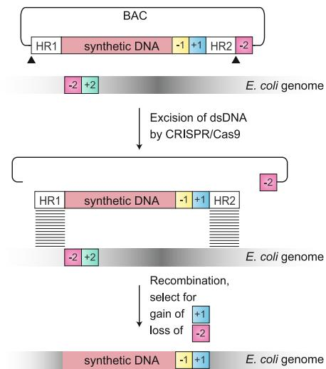

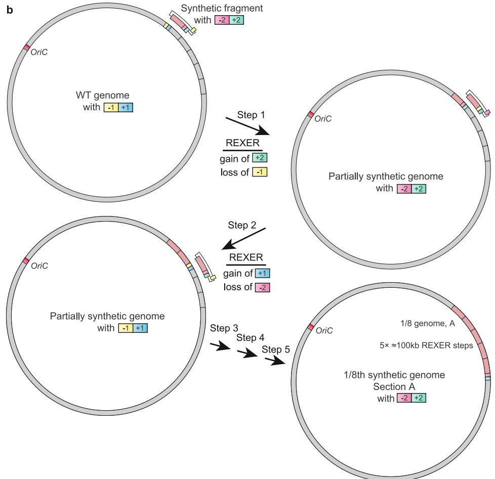  
Extended Data Fig. 1 | Using 100-kb fragments of synthetic DNA to replace the corresponding regions in the genome through REXER, and using GENESIS for the stepwise replacement of genomic DNA by synthetic DNA to generate recoded sections. a, REXER uses CRISPR– Cas9- and lambda-red-mediated recombination to replace genomic DNA with synthetic DNA provided from an episome (BAC). This enables large regions of the genome $( > 1 0 0 \mathrm { k b } )$ to be replaced by synthetic DNA17. The black triangles denote the location of CRISPR protospacers, which are cleaved by Cas9 to liberate the synthetic DNA (pink) cassette from the BAC flanked by homology regions. Homology regions 1 and 2 program the location of recombination into the E. coli genome. The double-selection cassette $( - 1 , + 1 )$ ensures the integration of the synthetic DNA, and the double-selection cassette $( - 2 , + 2 )$ on the genome ensures the removal of

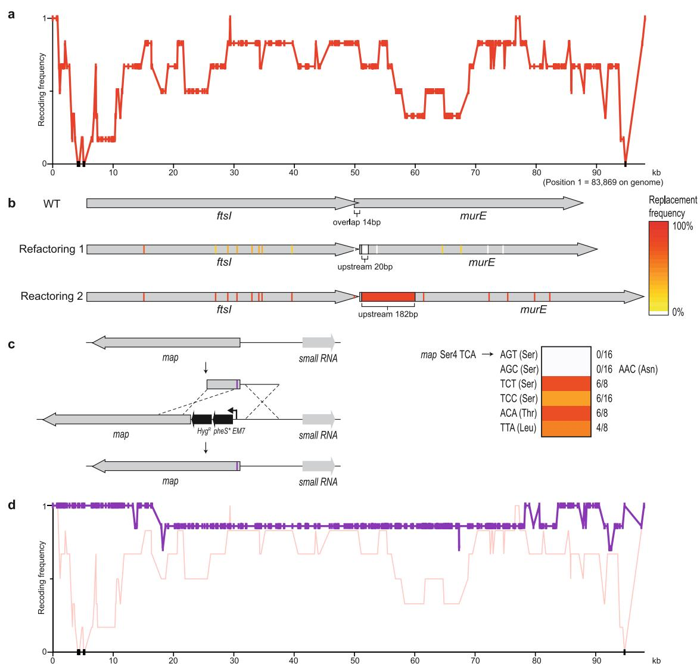  
Extended Data Fig. 2 | Recoding ftsI-murE and map in fragment 1. a, Recoding landscape of fragment 1. We sequenced six clones after REXER. Each dot represents the frequency of recoding within the sequenced clones (y axis) for a target codon at the indicated position in the genome $x$ axis). Black dots indicate positions at which we did not observe recoding. Four codons and a refactoring of ftsI-murE, and one codon in map, were rejected. b, Refactoring the 14-bp overlap of ftsI and murE. The codons and overlaps are colour-coded by their post-REXER replacement frequency in the clones sequenced. Using our initial refactoring scheme (refactoring 1) (in which the overlap plus $2 0 \mathrm { { b p } }$ of upstream sequence was duplicated), we did not observe replacement of the overlap by synthetic DNA (in the six clones sequenced after REXER). Refactoring scheme 2 (refactoring 2) (which duplicates the overlap plus 182 bp of upstream sequence) resulted in complete recoding of this region in 12 of the 16 post-REXER clones that we sequenced. c, Testing   
alternative codons at Ser4 in map. A double-selection cassette, pheS∗- $H y g ^ { R }$ , on a constitutive EM7 promoter was introduced upstream of map, followed by a ribosome-binding site. We replaced the cassette using linear double-stranded DNA that introduces alternative codons (purple bar) at position four, via lambda-red recombination and negative selection for loss of $p h e S *$ DNA with AGC and AGT did not integrate (0/16 clones); we recovered one clone for AGC but sequencing revealed that it contained a mutant AAC (Asn) codon. TCT (6/8), TCC (6/16), ACA (6/8) and TTA (4/8) were allowed. d, Recoding landscape (purple) over the genomic region shown in a, following REXER with a BAC that contained refactoring scheme 2 for the ftsI-murE overlap and TCT at position 4 in map. In total, 2/7 post-REXER clones were completely refactored and recoded, and each target codon was replaced in at least 5/7 clones. The data from a are shown in red for comparison.

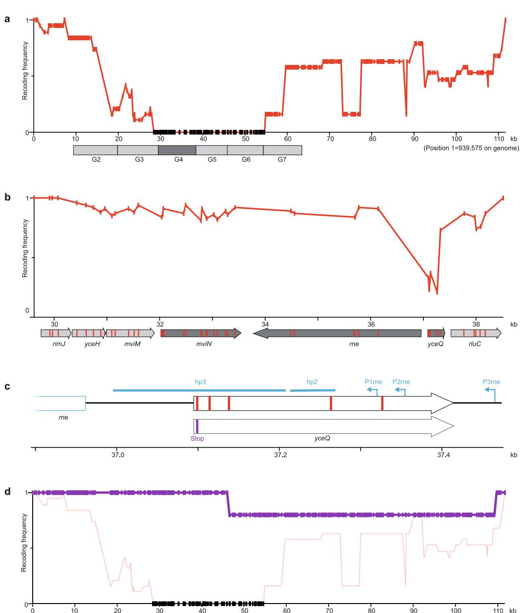

Extended Data Fig. 3 | Recoding rne and yceQ in fragment 9. a, Recoding landscape of fragment 9. Our designed synthetic sequence of fragment 9 was integrated into the genome by REXER, and 19 clones were completely sequenced by next-generation sequencing. The recoding landscape graph shows the frequency at which each target codon was recoded across the 19 clones. Although most codon replacements were accepted, recoding of a 26-kb region was consistently rejected; codon positions with a recoding frequency of zero in all the sequenced clones are indicated by black dots. To pinpoint the problematic sequence, $1 0 { \cdot } \mathrm { k b }$ stretches of the genome (labelled G2 to G7) were deleted in the presence of the episomal copy of synthetic fragment 9. The synthetic sequence was sufficient to support deletion of all stretches except G4 (dark grey box), which suggests that an underlying problem is within this stretch. None of the nineteen clones was completely recoded. b, Recoding landscape of stretch G4. After REXER across the 10-kb G4 stretch, and sequencing of 10 clones, the recoding landscape shown was generated. This revealed a clear recoding minimum at yceQ—a ‘gene’ that encodes a predicted protein for which there is little evidence of transcription, protein synthesis or homologues37. All target codons in yceQ were recoded at least once in individual clones, but never simultaneously; thus, the minimum of the recoding landscape does not reach zero, and 0/10 clones were completely recoded. This is consistent with epistasis between the targeted positions. In the map below the recoding landscape, sequences annotated as essential are shown in dark grey and target codons are shown in red. The sequence position $x$ axis) is with reference to a. c, Altered design of the region surrounding rne in fragment 9. Top, original design of yceQ recoding and rne (which encodes RNase E) regulatory sequences. Target codons are shown in red. P1rne, P2rne and P3rne are the promoters (blue arrows) for the essential gene rne; these are found in and around the hypothetical gene yceQ. The $^ { - 1 0 }$ sequence of the major promoter P1rne is mutated by our initial design. The sequences that contains hairpin 1 (hp1) and hairpin 2 (hp2), which bind to RNase E to mediate transcript degradation, are shown as blue bars; these sequences encompass the remaining target codons and are also mutated by our initial design. Bottom, the second codon in yceQ was replaced with a stop codon (purple) and the remaining target codons retained their original sequence. The sequence position $x$ axis) is with reference to a. d, The modified fragment 9 (from c) was integrated on the genome, which resulted in complete recoding in $4 / 5$ clones that we sequenced. The axes of the graph are the same as in a. The recoding landscape for the modified fragment 9, derived from sequencing five clones, is shown in purple. The data from a are reproduced for comparison.

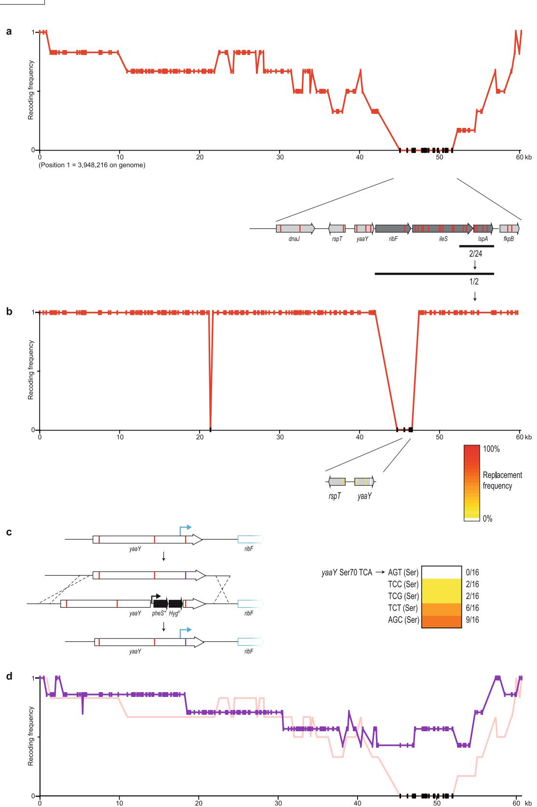

Extended Data Fig. 4 | See next page for caption.

Extended Data Fig. 4 | Recoding yaaY in fragment 37a. a, Recoding landscape of fragment 37a. Our designed synthetic sequence of fragment 37a was integrated into the genome by REXER, and six clones were completely sequenced by next-generation sequencing. Although most codon replacements were accepted, recoding of a 6.5-kb region was consistently rejected. Target-codon positions that were never recoded in the six clones sequenced are indicated by black dots. b, Identification of the problematic target codon. Within the identified 6.5-kb problematic region, we first focused on codons in essential genes (dark grey arrows) rather than non-essential genes (light grey arrows). Sanger sequencing (black bar) of 24 clones showed that 2 clones were recoded in all 6 target codons within a sub-section of the essential genes. Further Sanger sequencing of the remaining target codons in essential genes in these two clones revealed that 1 clone was recoded at all 17 target codons. This clone was completely sequenced by next-generation sequencing and used to generate a recoding landscape, in which each target codon is either recoded (red) or not recoded (black). In combination with the recoding landscape in a, this enabled us to identify a problematic region $1 . 8 \mathrm { - k b }$ upstream of ribF. Here we focused on the four target codons in the genes rpsT and yaaY as the nearest codons to the essential ribF gene. Sanger

sequencing of 33 clones across this sequence revealed only 1 codon that was never recoded—the codon for Ser70 in the hypothetical gene yaaY (sequencing results are shown as colour-coded on the gene map of rspT and yaaY). We therefore investigated alternative codon replacements in yaaY. c, Alternative codon replacement in the hypothetical gene yaaY. At position Ser70 in this gene, replacement of TCA with AGT was not successful. To investigate alternative codon replacement schemes, a double-selection marker $( p h e S * - H y g ^ { R } )$ on a constitutive EM7 promoter, followed by a ribosome-binding site, was introduced into yaaY, 12 bp upstream of the codon for Ser70. The negative-selection marker was then used to select for clones that had replaced the cassette using linear doublestranded DNA that introduces alternative codons (purple bar) at position 70, via lambda-red recombination. Although linear double-stranded DNA with AGT did not integrate (0/16 clones), integration of double-stranded DNA with TCC (2/16), TCG (2/16), TCT (6/16) and AGC (9/16) proved viable. d, Recoding landscape following REXER with a BAC that contains a corrected version of fragment 37a, bearing AGC at position Ser70 in the hypothetical gene yaaY (purple). When integrated by REXER, we identified 1/7 completely recoded clones. AGC at position Ser70 in yaaY was introduced in 4/7 clones.

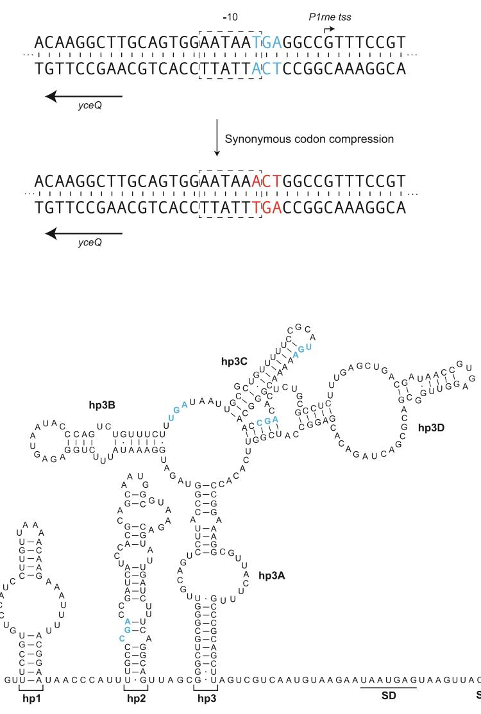  
Extended Data Fig. 5 | Substitutions in the hypothetical gene yceQ overlap with regulatory elements in rne. a, In our original design, a programmed substitution of a TCA (blue) to AGT (red) in the hypothetical gene yceQ leads to mutation of the $^ { - 1 0 }$ region of the P1rne promoter (boxed). The transcriptional start site (tss) of this promoter for rne transcription is indicated by an arrow; this is the major promoter for rne transcription. b, Target-codon substitutions overlap with and may

potentially disrupt the key regulatory hairpins (hp2 and hp3) in the long $5 ^ { \prime }$ untranslated region of the rne transcript. hp2 and hp3 mediate a regulatory feedback loop, in which RNase E is recruited to the mRNA to promote degradation of its own transcript. A schematic of the wild-type secondary structure of the rne $5 ^ { \prime }$ untranslated region is shown40. The target codons for synonymous replacement are highlighted in blue.

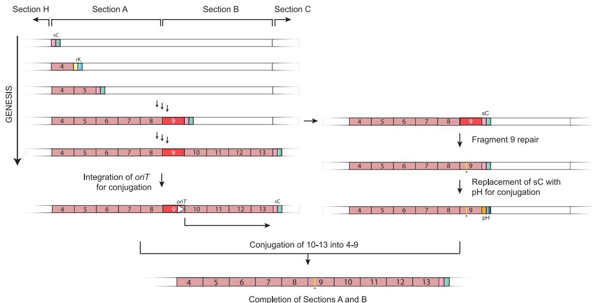

b

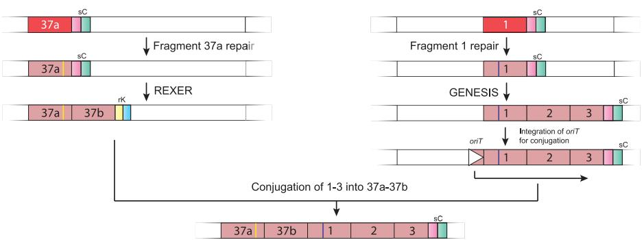  
Completion of Section H

Extended Data Fig. 6 | Completing sections A, B and H. a, GENESIS was initiated with fragment 4 and proceeded smoothly until fragment 9, in which we were unable to recode yceQ. Identifying and fixing the problems with our initial design of fragment 9 was carried out as described in Extended Data Fig. 3, by introducing a stop codon (yellow line) at the start of the predicted yceQ ORF. Following a swap of the sacB-cat (sC) double-selection cassette at the end of fragment 9 for a pheS∗-HygR (pH) double selection cassette, this strain was ready to act as the recipient for conjugation to assemble a strain in which fragments 4–13 (section A plus section B) are fully recoded. In parallel, we continued to recode the strain that contains the recoded fragment 4 to incomplete fragment 9 by GENESIS; this generated a second strain for assembly in which fragments 4–8 and 10–13 were completely recoded, and fragment 9 was partially recoded. We then integrated oriT (white triangle) $\bar { 3 } \mathrm { k b }$ upstream of the start of fragment 10 in the second strain to generate a donor for

conjugation, to assemble a strain in which fragments 4–13 (section A plus section B) are fully recoded. Conjugation of the donor and recipient strains resulted in a strain in which sections A and B are fully recoded. rK, rpsL-kanR double-selection cassette. b, Individual REXER of fragments 37a and 1 led to incomplete recoding. We carried out troubleshooting of both fragments independently (Extended Data Figs. 2, 4). The repairs are indicated with yellow and purple lines in fragment 37a and fragment 1, respectively. Each strain then served as a starting point for two independent sets of GENESIS; one generated $3 7 a - 3 7 b$ (on the left) and ended in an rpsL-kanR double-selection cassette, and one generated 1–3 (on the right) and ended in a sacB-cat double-selection cassette. We integrated an oriT (white triangle) $3 \mathrm { k b }$ upstream of the start of fragment 1, and this strain served as a donor for the directed conjugation of 1–3 into 37a–37b. The correct product was selected for by the gain of cat and the loss of rpsL. This resulted in the completion of section H in a single strain.

# RE SEARC H Article

Extended Data Fig. 7 | See next page for caption.

Extended Data Fig. 7 | Assembly of an organism with a fully synthetic genome through conjugation of recoded genome sections. a, Schematic assembly of partially synthetic donor and recipient genomes into a more-synthetic genome, through conjugation. In the recipient cell, the recoded genome section (pink) is extended with recoded DNA (dark pink)—commonly, 3–4 kb—by a lambda-red-mediated recombination and positive and negative selection; this step takes advantage of the genomic markers at the end of the recoded sequence that are introduced by GENESIS, and provides a homology region with the end of the recoded fragment in the donor strain. The donor strain is prepared by integration of an oriT at the end of the recoded DNA. The indicated positive and negative selection ensures the survival of recipient strains, and selects for recipients that have successfully integrated the synthetic DNA from the donor. An $\mathrm { F ^ { \prime } }$ plasmid that contains a mutation in the oriT sequence that makes it non-transferrable was used to facilitate conjugation of the donor genome to the recipient. $+ 2$ , cat; $^ { - 2 }$ , sacB; $+ 3 ,$ $H \dot { \gamma } g ^ { R }$ ; $^ { - 3 }$ , pheS∗; $+ 4 ,$ , aacC1 (a gene conferring gentamycin resistance); $+ 5$ , tetA (a gene

conferring tetracycline resistance). The homologous regions in the donor and recipient are both shown in dark pink. b, Synthetic genomic sections (pink) from multiple individual partially recoded genomes were assembled into a single fully recoded genome using conjugative assembly. The donor (d) and recipient (r) strains contain unique recoded genomic sections labelled in pink; recoded overlapping homology regions ( $3 \mathrm { k b }$ to $4 0 0 \mathrm { k b }$ in size) were used to seamlessly recombine the strains, and are shown in dark pink. Small homology regions ranging from 3 to $5 \mathrm { k b }$ in size are denoted with an asterisk. Conjugations for which we used greater than 5-kb homology (HR) are indicated. For assembly, the recoded genomic content from the donor was conjugated in a clockwise manner to replace the corresponding wild-type genomic section (grey) in the recipient. The origin of strain AB and strain H is described in detail in Extended Data Fig. 6; all other individual synthetic genomes were generated by GENESIS (Extended Data Fig. 1). Conjugation followed by recombination proceeded until the final fully recoded A–H strain was assembled and sequenceverified by next-generation sequencing.

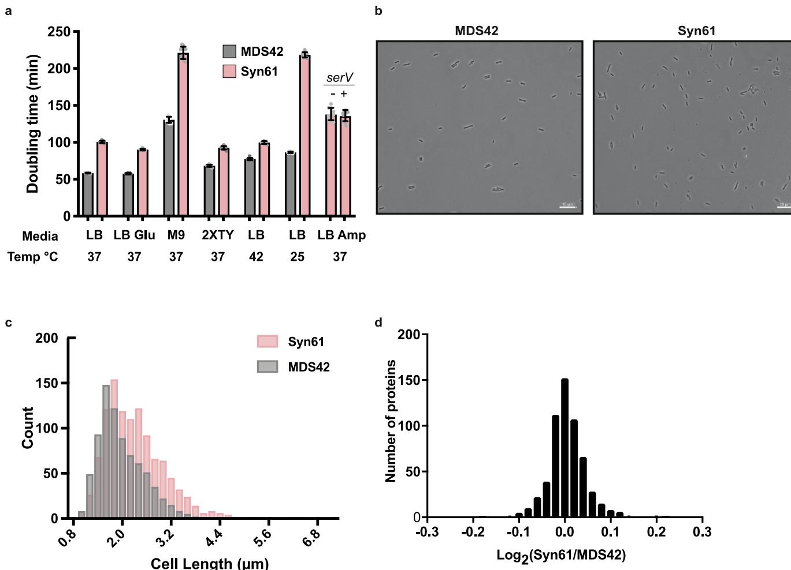  
Extended Data Fig. 8 | Characterization of an organism with a fully synthetic genome. a, Doubling times for Syn61 and MDS42. Our fully synthetic recoded $E$ . coli Syn61 has a doubling time that is $1 . 6 \times$ longer than that of $\mathrm { M D S } 4 2 ^ { 3 2 }$ , when grown in standard medium conditions $( 9 0 . 1 \mathrm { m i n } $ versus $5 7 . 6 \mathrm { m i n }$ in lysogeny broth $( \mathrm { L B } ) + 2 \%$ glucose). The ratio of growth rates between Syn61 and MDS42 in LB (decreased carbon catabolite repression) at $3 7 ^ { \circ } \mathrm { C }$ is 1.7, in M9 minimal medium is 1.7, in richer medium (2XTY) is 1.4, in LB at $2 5 ^ { \circ } \mathrm { C }$ is 2.5 and in LB at $4 2 ^ { \circ } \mathrm { C }$ is 1.3. The doubling times in different medium conditions are: LB at $3 7 ^ { \circ } \mathrm { C } ,$ , 58.3 min and $1 0 0 . 6 \mathrm { m i n }$ ; $\mathrm { L B } + 2 \%$ glucose, $5 7 . 6 \mathrm { m i n }$ and $9 0 . 1 \mathrm { { m i n } }$ ; M9 minimal medium, $1 3 0 . 5 \mathrm { m i n }$ and $2 2 1 . 1 \mathrm { m i n }$ ; 2XTY, $6 8 . 2 \mathrm { m i n }$ and $9 2 . 6 \mathrm { { m i n } }$ ; LB at $2 5 ^ { \circ } \mathrm { C }$ , 86.3 min and $2 1 8 . 4 \mathrm { m i n }$ ; LB at $4 2 ^ { \circ } \mathrm { C }$ , 77.4 min and $9 9 . 7 \mathrm { m i n }$ , for MDS42 and Syn61, respectively. Syn61 containing a plasmid without $( - )$ or with $( + )$ serV exhibited a growth-rate ratio of 0.99 $1 3 8 . 3 \mathrm { m i n }$ versus $1 3 6 . 2 \mathrm { m i n }$ ). Doubling times represent the average of ten independently grown biological replicates of each strain, and are shown as mean $\pm$ s.d. (see Supplementary Methods). The data for individual experiments are represented by dots. b, Representative microscopy images   
of E. coli strain MDS42 and Syn61. Samples were imaged on an upright Zeiss Axiophot phase-contrast microscope using a $6 3 \times 1 . 2 5$ NA Plan Neofluar phase objective (see Supplementary Methods). The experiment was performed twice with similar results. c, Histogram of cell lengths quantified from microscopy images of strains MDS42 and Syn61. The mean cell length $( \pm s . \mathbf { d . } )$ for MDS42 was $1 . 9 7 \pm 0 . 5 7 \mu \mathrm { m }$ and for Syn61 was $2 . 3 \pm 0 . 7 4 \mu \mathrm { m }$ . Images of $n = 5 0 0$ cells were taken during exponential growth phase for both strains. Cell-length measurements were made using Nikon NIS Elements software (see Supplementary Methods). A 1- $\mu \mathrm { m }$ lower size limit was imposed to remove background particulates and dust from quantification; this also precludes quantification of extracellular vesicles. d, Label-free quantification of the MDS42 and Syn61 proteomes. Each strain was grown in three biological replicates. Each biological replicate was analysed by tandem mass spectrometry in technical duplicate. Technical duplicates of biological replicates were merged. A total of 1,084 proteins was quantified across the samples. No protein quantified in both MDS42 and Syn61 differed in abundance—as judged by label-free quantification values—by more than 1.16-fold.

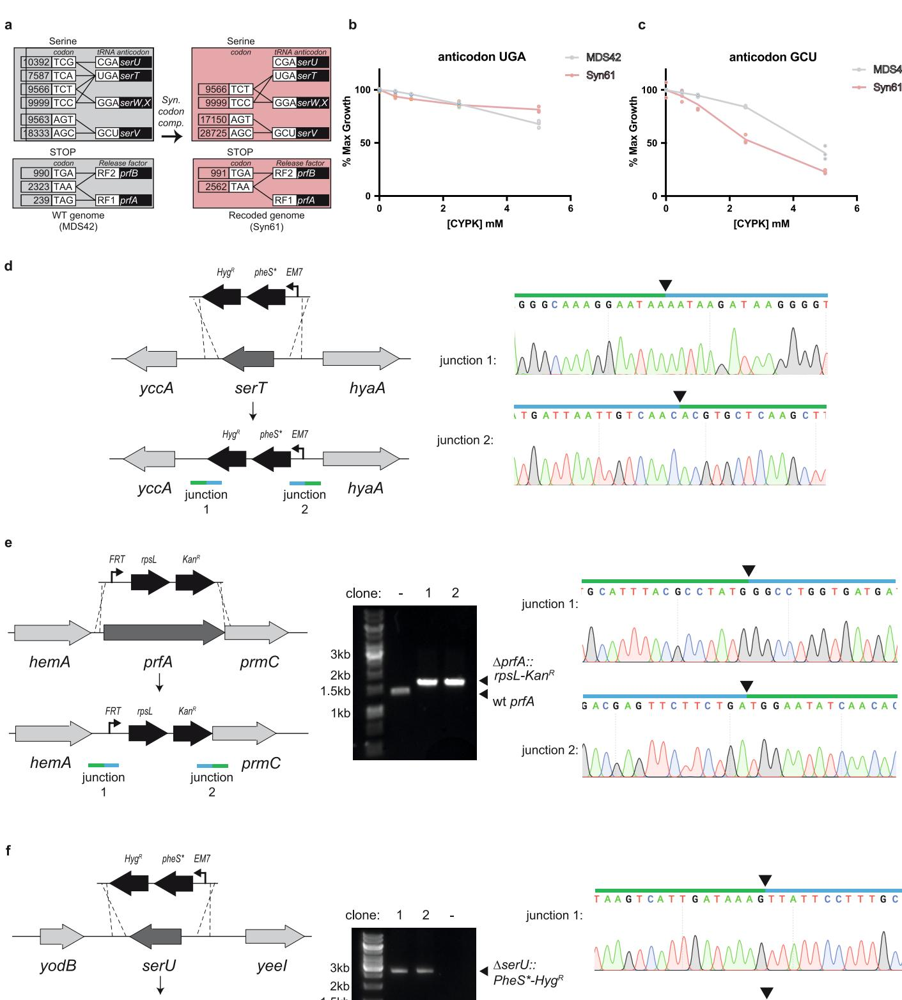

Extended Data Fig. 9 | See next page for caption.

Extended Data Fig. 9 | Consequences of synonymous codon compression in Syn61. a, Synonymous codon compression and deletion of $p r f A$ , serU and serT in E. coli. The grey boxes shows the E. coli serine codons and stop codons, together with the tRNAs and release factors that decode them in wild-type E. coli (WT genome). tRNA anticodons and release factors are connected to the codons that they are predicted to read by black lines. The tRNA and release factor genes are shown in the black boxes. Synonymous codon compression (syn. codon. comp.) leads to Syn61 cells with a recoded genome (pink boxes), in which TCG and TCA codons are removed. The abundance of each codon is listed in its box. b, As in Fig. 4b, but with the M. mazei $\mathrm { P y l R S / t R N A ^ { P y l } u g a }$ pair (anticodon UGA). There are fewer cognate codons to this anticodon in Syn61 than in MDS42; CYPK addition might therefore be expected to be less toxic in Syn61, as observed. c, As in Fig. 4b, but with the M. mazei PylRS/tRNAPylGCU pair (anticodon GCU). There are a greater number of cognate codons to this anticodon in Syn61 than in MDS42; CYPK addition might therefore be expected to be more toxic in Syn61, as observed. d, serT (dark grey) is deleted by insertion of a $\large P h e S * - H y g ^ { R }$ double-selection cassette (black) via lambda-red-mediated recombination. Recombination yields new junctions 1 and 2, indicated by green and blue bars. For each recombination, both junctions were sequence-verified by Sanger sequencing. Above the Sanger chromatograms, the arrows indicate the precise location of the junction, the blue bar indicates the sequence that corresponds to the selection cassette and the green bar corresponds to the genomic sequence that flanks the selection cassette. The primers used to generate selection cassettes with suitable homologies to serU, serT and prfA for recombination are provided in Supplementary Data 21. The experiment was performed once. e, prfA (dark grey) is deleted by the insertion of an rpsL-kanR double-selection cassette (in black) via lambda-red-mediated homologous recombination. The agarose gels are annotated as described in Fig. 4c, and the rest of the data are annotated as described in d. The experiment was performed once. f, serU (dark grey) is deleted by insertion of a $P h e S * - H y g ^ { R }$ double-selection cassette (in black) via lambda-red-mediated recombination. The agarose gels are annotated as described in Fig. 4c, and the rest of the data are annotated as described in d. The experiment was performed once. The full gels are available in Supplementary Fig. 1.

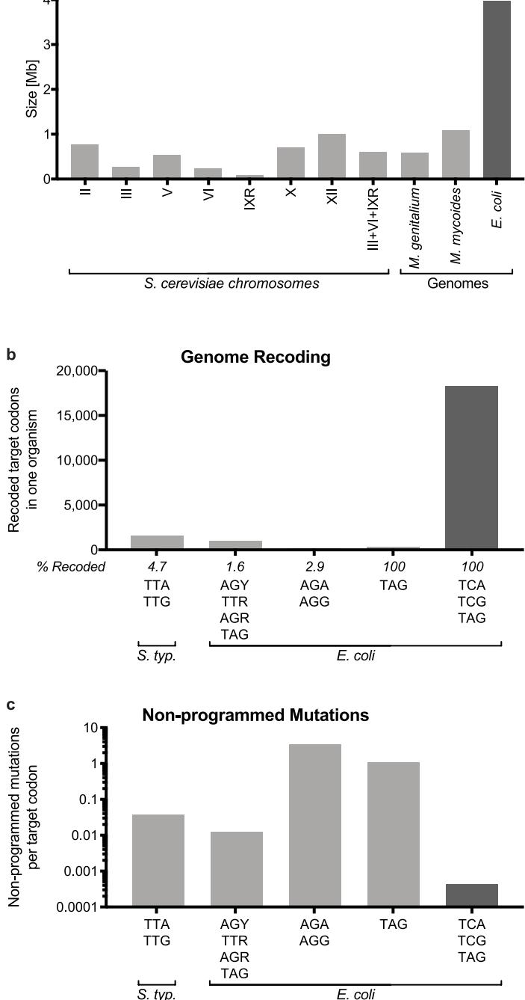

Extended Data Fig. 10 | The scale of genome synthesis, and scale and fidelity of recoding. a, Genome and chromosome synthesis. The size (in Mb) of synthetic genomes that have been produced for $M$ . genitalium and M. mycoides22,23, and several S. cerevisiae chromosomes24–31 (light grey). The size of the synthetic $E$ . coli genome presented here is shown in dark grey. b, Genome recoding efforts. Attempts to recode target codons TTA and TTG in Salmonella enterica serovar Typhimurium $\bar { \mathrm { L T } } 2 ^ { 1 8 }$ ; AGC, AGT, TTG, TTA, AGA, AGG and TAG in E. coli19; AGA and AGG in $E$ . coli16, as well as recoding of all TAG in E. coli14 (light grey), compared to the removal of all TCA, TCG and TAG in E. coli presented here (dark grey). The total number of codons recoded in a single strain is shown on the graph, and the maximum percentage of target codons recoded in a single strain in each effort is indicated. c, Number of reported non-programmed mutations and indels as a function of the number of target codons recoded for the experiments shown in b.

# natureresearch

# Reporting Summary

Nature Research wishes to improve the reproducibility of the work that we publish. This form provides structure for consistency and transparency in reporting. For further information on Nature Research policies, see Authors & Referees and the Editorial Policy Checklist.

# Statistics

For all statistical analyses, confirm that the following items are present in the figure legend, table legend, main text, or Methods section.

n/a Confirmed

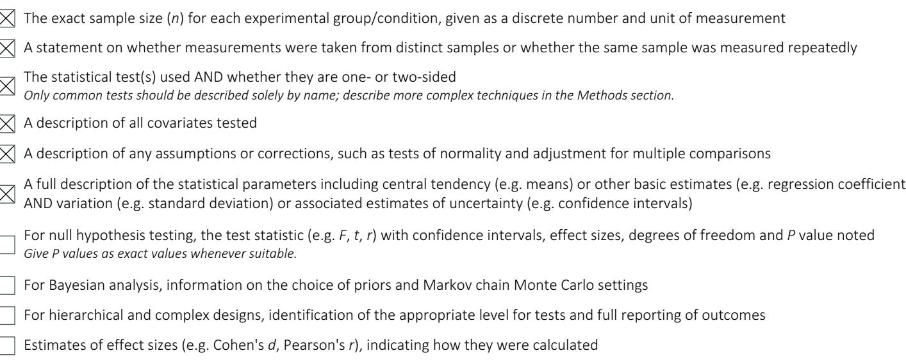

Our web collection on statistics for biologists contains articles on many of the points above.

# Software and code

Policy information about availability of computer code

<html><body><table><tr><td>Data collection</td><td>none</td></tr><tr><td>Data analysis</td><td>Code used in creating the designed sequence and in analysis is described n the methods, where inks to the Github repositor re provided (htp://ithub.com/TiongSun/genome_recoding)(htp://ithub.com/Tiongun/recoding_|andscape). These links wil be made available upon publication. This code was made available to reviewers and editors during review. Publicly available ofwarebowti2.3.2, smtools 1.1, eq (htp//github.om/Tiongun/iseq), Integrative Genomics ieer2.4, eye</td></tr></table></body></html>

For manuscripts utilizing custom algorithms or software that are central to the research but not yet described in published literature, software must be made available to editors/reviewers.   
We strongly encourage code deposition in a community repository (e.g. GitHub). See the Nature Research guidelines for submitting code & software for further information.

# Data

# Policy information about availability of data

All manuscripts must include a data availability statement. This statement should provide the following information, where applicable:

- Accession codes, unique identifiers, or web links for publicly available datasets - A list of figures that have associated raw data - A description of any restrictions on data availability

The sequences and genome design details used in this study are available in the Supplementary Data. Supplementary Data 1 provides the GenBank file of the E. coli MDS42 genome (NCBI accession number AP012306.1); Supplementary Data 2 provides the GenBank file of designed synthetic E. coli genome with codon replacements and refactorings; Supplementary Data 3 provides the table of target codons; Supplementary Data 4 provides the table of overlaps and refactoring;

Supplementary Data 5 provides the table of 10-kb stretches; Supplementary Data 6 provides the GenBank file of the BAC sacB-cat-rpsL; Supplementary Data 7 provides the GenBank file of BAC-rpsL-kanR-sacB; Supplementary Data 8 provides the GenBank file of the BAC rpsL-kanR-pheS?-HygR; Supplementary Data 9 provides the table of BAC construction; Supplementary Data 10 provides the table of BAC assembly; Supplementary Data 11 provides the table of REXER experiments; Supplementary Data 12 provides the GenBank file of spacer plasmids without trans-activating CRISPR RNA (tracrRNA) and annotation for linear spacers; Supplementary Data 13 provides the GenBank file of spacer plasmids with tracrRNA and annotation for linear spacers; Supplementary Data 14 provides the table of oligonucleotides used for recoding fixing experiments; Supplementary Data 15 provides the GenBank file of the gentamycin-resistance oriT cassette; Supplementary Data 16 provides the oligonucleotide primers used for conjugation; Supplementary Data 17 provides the GenBank file of the pJF146 Fʹ plasmid that does not self-transfer; Supplementary Data 18 provides the GenBank file of the fully recoded genome of Syn61, verified by next-generation sequencing; Supplementary Data 19 provides the table of design optimizations and nonprogrammed mutations; Supplementary Data 20 provides a list of the proteins identified by tandem mass spectrometry; and Supplementary Data 21 provides a list of the primers used for deletion experiments. All other datasets generated and/ or analysed in this study are available from the corresponding author on reasonable request. All materials (Supplementary Data 9, 12, 13, 17, 18) from this study are available from the corresponding author upon reasonable request.

# Field-specific reporting

Please select the one below that is the best fit for your research. If you are not sure, read the appropriate sections before making your selection.

Life sciences

Behavioural & social sciences

Ecological, evolutionary & environmental sciences

For a reference copy of the document with all sections, see nature.com/documents/nr-reporting-summary-flat.pdf

# Life sciences study design

All studies must disclose on these points even when the disclosure is negative.

<html><body><table><tr><td>Sample size</td><td>No salai tar  leeefe sizes used, as indicated in the manuscript, were deemed appropriate.</td></tr><tr><td>Data exclusions</td><td>There are no data exclusions</td></tr><tr><td>Replication</td><td>[The exact number of replicates is stated in the relevant legend. Al attempts at replication were successful.</td></tr><tr><td>Randomization</td><td>No randomization. This is not relevant because the samples form defined groups.</td></tr><tr><td>Blinding</td><td>No blinding.Binding is not relevant to the study. The groups wereefined nd studied by the investigator using standard protocols.</td></tr></table></body></html>

# Reporting for specific materials, systems and methods

We require information from authors about some types of materials, experimental systems and methods used in many studies. Here, indicate whether each material, system or method listed is relevant to your study. If you are not sure if a list item applies to your research, read the appropriate section before selecting a response.

# Materials & experimental systems

# Methods

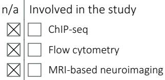

n/a Involved in the study Antibodies Eukaryotic cell lines Palaeontology Animals and other organisms Human research participants Clinical data