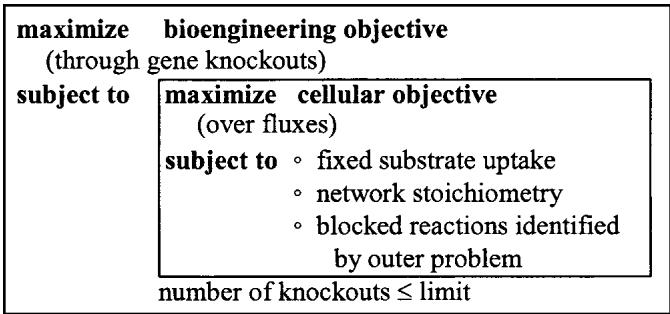
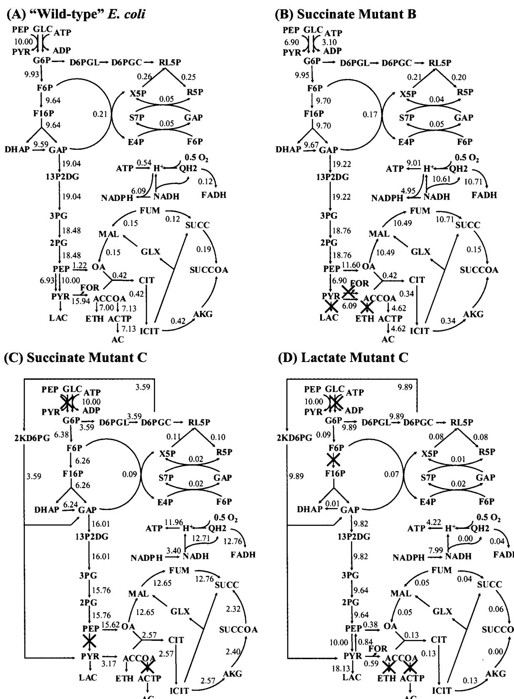
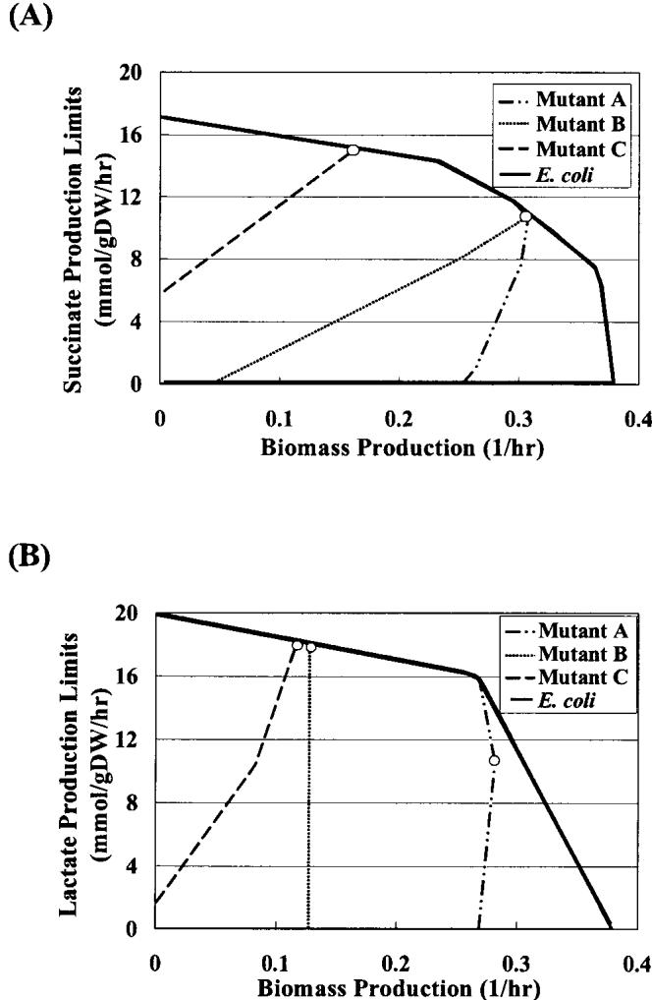
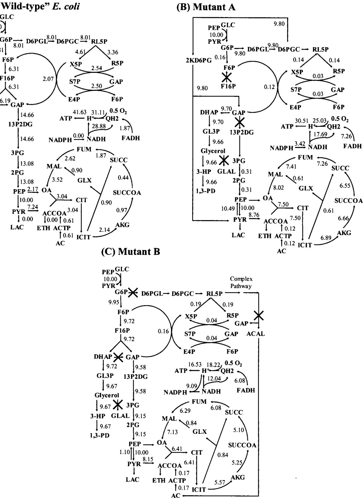
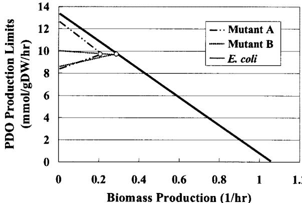
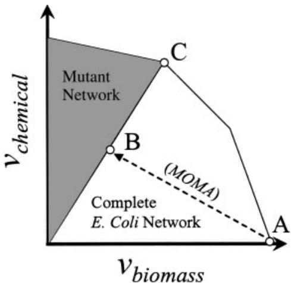

# OptKnock: A Bilevel Programming Framework for Identifying Gene Knockout Strategies for Microbial Strain Optimization

Anthony P. Burgard, Priti Pharkya, Costas D. Maranas

Department of Chemical Engineering, The Pennsylvania State University, University Park, Pennsylvania 16802; telephone: (814) 863-9958; fax: (814) 865-7846; e-mail: costas@psu.edu

Received 23 March 2003; accepted 9 July 2003

Published online 7 October 2003 in Wiley InterScience (www.interscience.wiley.com). D01: 10.1002/bit. 10803

Abstract: The advent of genome-scale models of metabolism has laid the foundation for the development of computational procedures for suggesting genetic manipulations that lead to overproduction. In this work, the computational OptKnock framework is introduced for suggesting gene deletion strategies leading to the overproduction of chemicals or biochemicals in E. coli. This is accomplished by ensuring that a drain towards growth resources (i.e., carbon, redox potential, and energy) must be accompanied, due to stoichiometry, by the production of a desired product. Computational results for gene deletions for succinate, lactate, and 1,3-propanediol (PDO) production are in good agreement with mutant strains published in the literature. While some of the suggested deletion strategies are straightforward and involve eliminating competing reaction pathways, many others suggest complex and nonintuitive mechanisms of compensating for the removed functionalities. Finally, the OptKnock procedure, by coupling biomass formation with chemical production, hints at a growth selection/adaptation system for indirectly evolving overproducing mutants. $©$ 2003 Wiley Periodicals. Biotechnol Bioeng 84: 647– 657, 2003.

Keywords:genome-scale stoichiometric models;bilevel programming; strain optimization

# INTRODUCTION

The systematic development of engineered microbial strains for optimizing the production of chemicals or biochemicals is an overarching challenge in biotechnology (Stephanopoulos et al., 1998). However, in the absence of metabolic and genetic engineering interventions, the product yields of many microorganisms are often far below their theoretical maximums. This is expected because cellular metabolism is primed, through natural selection, for the maximum responsiveness to the history of selective pressures rather than for the overproduction of specific chemical compounds. Not surprisingly, the behavior of metabolic networks is governed by internal cellular objectives which are often in direct competition with chemical overproduction targets. In this work, a bilevel optimization framework termed OptKnock is developed for suggesting gene knockout strategies for biochemical overproduction while recognizing that metabolic flux distributions are governed by internal cellular objectives. Here we explore two such objectives, specifically, the maximization of biomass yield and the minimization of metabolic adjustment (MOMA).

The recent explosion of annotated sequence information along with a wealth of chemical literature has enabled the reconstruction of genome-scale metabolic networks for many microorganisms (Edwards and Palsson, 2000; Schilling and Palsson, 2000; Schilling et al., 2002; Forster et al., 2003). This information, used in the context of the flux balance analysis (FBA) modeling framework (Varma and Palsson, 1993), has been employed extensively to explore the integrated functions of metabolic networks (Burgard and Maranas, 2001; Burgard et al., 2001; Papin et al., 2003; Price et al., 2003). FBA models typically invoke the optimization of a particular cellular objective (e.g., ATP production (Majewski and Domach, 1990; Ramakrishna et al., 2001), biomass formation (Varma and Palsson, 1993, 1994), minimization of metabolic adjustment (Segre et al., 2002)), subject to network stoichiometry, to suggest a likely flux distribution. Stoichiometric models of Escherichia coli metabolism utilizing the biomass maximization hypothesis have been in some cases successful at 1) predicting the lethality of gene knockouts (Edwards and Palsson, 2000; Badarinarayana et al., 2001); 2) identifying the correct sequence of byproduct secretion under increasingly anaerobic conditions (Varma et al., 1993); and 3) quantitatively predicting cellular growth rates under certain conditions (Edwards et al., 2001). Interestingly, recent work suggests that even when FBA predictions under the biomass maximization assumption seem to fail, metabolic networks can be evolved, for certain cases, towards maximum growth (i.e., biomass yield) through adaptive evolution (Ibarra et al., 2002).

The ability to investigate the metabolism of singlecellular organisms at a genomic scale, and thus systemic level, motivates the need for novel computational methods aimed at identifying strain engineering strategies. In this work, we introduce the OptKnock framework for suggesting gene deletion strategies leading to the overproduction of specific chemical compounds in $E$ coli. This is accomplished by ensuring that the production of the desired chemical becomes an obligatory byproduct of growth by "'shaping'' the connectivity of the metabolic network. In other words, OptKnock identifies and subsequently removes metabolic reactions that are capable of uncoupling cellular growth from chemical production. The computational procedure is designed to identify not just straightforward but also nonintuitive knockout strategies by simultaneously considering the entire $E$ , coli metabolic network as abstracted in the in silico $E .$ coli model of Palsson and co-workers (Edwards and Palsson, 2000). The complexity and built-in redundancy of this network (e.g., the $E$ coli model encompasses 720 reactions) necessitates a systematic and efficient search approach to combat the combinatorial explosion of candidate gene knockout strategies.

The nested optimization framework shown in Figure 1 was developed to identify multiple gene deletion combinations that maximally couple cellular growth objectives with externally imposed chemical production targets. This multilayered optimization structure involving two competing optimal strategists (i.e., cellular objective and chemical production) is referred to as a bilevel optimization problem (Bard, 1998). Problem formulation specifics, along with an elegant solution procedure drawing upon linear programming (LP) duality theory, are described in Materials and Methods. The OptKnock procedure is applied to succinate, lactate, and 1,3-propanediol (PDO) production in $E$ coli with the maximization of the biomass yield for a fixed amount of uptaken glucose employed as the cellular objective. The obtained results are also contrasted against using the minimization of metabolic adjustment (Segre et al., 2002) as the cellular objective. Based on the OptKnock framework, we identify the most promising gene knockout strategies and their corresponding allowable envelopes of chemical versus biomass production in the context of succinate, lactate, and PDO production in $E$ , coli.

  
Figure 1. The bilevel optimization structure of OptKnock. The inner problem performs the flux allocation based on the optimization of a particular cellular objective (e.g., maximization of biomass yield, MOMA, etc.). The outer problem then maximizes the bioengineering objective (e.g., chemical production) by restricting access to key reactions available to the optimization of the inner problem.

# MATERIALS AND METHODS

The maximization of a cellular objective quantified as an aggregate reaction flux for a steady-state metabolic network comprising a set $\mathcal { N } = \{ 1 , . . . , N \}$ of metabolites and a set $\mathcal { M } = \{ 1 , . . . , M \}$ of metabolic reactions fueled by a glucose substrate is expressed mathematically as follows:

$$
\begin{array} { l } { \displaystyle \sum _ { j = 1 } ^ { M } S _ { i j } \nu _ { j } = 0 , \quad \quad \quad \forall i \in \mathcal { N } } \\ { \displaystyle \nu _ { p t s } + \nu _ { g l k } = \nu _ { g l c \_ u p t a k e } \ m m o l / g D W \cdot h r } \end{array}
$$

$$
\begin{array} { r l r l } & { \nu _ { a p } \geq \nu _ { a t p . m a i n } \ m m o l / g D W \cdot h r } \\ & { } & \\ & { \nu _ { b i o m a s } \geq \nu _ { b i o m a s } ^ { t a r g e t } \ 1 / h r } \\ & { \nu _ { j } \leq 0 , } & & { \forall j \ \in \mathcal { M } _ { \mathrm { i r r e v } } } \\ & { \nu _ { j } \leq 0 , } & & { \forall j \in \mathcal { M } _ { \mathrm { s e c r . o n l y } } } \\ & { \nu _ { j } \leq 0 , } & & { \forall j \in \mathcal { M } _ { \mathrm { s e c r . o n l y } } } \\ & { \nu _ { j } \in \mathcal { R } , } & & { \forall j \in \mathcal { M } _ { \mathrm { r e v } } } \end{array}
$$

in reaction $j , \nu _ { j }$ represents the flux of reaction $j$ $\nu _ { g l c . }$ uptake is the basis glucose uptake scenario, $\nu _ { a t p \_ m a i n }$ is the nongrowth-associated ATP maintenance requirement and $\nu _ { b i o m a s s } ^ { t a r g e t }$ is a minimum level of biomass production. The vector $\nu$ includes both internal and transport reactions. The forward (i.e., positive) direction of transport fluxes corresponds to the uptake of a particular metabolite, whereas the reverse (i.e., negative) direction corresponds to metabolite secretion. The uptake of glucose through the phoshphotransferase system and glucokinase are denoted by $\nu _ { p t s }$ and $\nu _ { g l k }$ , respectively. Transport fluxes for metabolites that can only be secreted from the network are members of $\mathcal { M } _ { \mathrm { s e c r \_ o n l y } }$ . Note also that the complete set of reactions $\mathcal { M }$ is subdivided into reversible ${ \mathcal { M } } _ { \mathrm { r e v } }$ and irreversible $\mathcal { M } _ { \mathrm { i r r e v } }$ reactions. The cellular objective is often assumed to be a drain of biosynthetic precursors in the ratios required for biomass formation (Neidhardt and Curtiss, 1996). The fluxes are reported per $1 \ g D W \cdot h r$ such that biomass formation is expressed as $g$ biomass produced/gDW.hr or 1/hr.

The modeling of gene deletions, and thus reaction elimination, first requires the incorporation of binary variables into the flux balance analysis framework (Burgard and Maranas, 2001; Burgard et al., 2001). These binary variables:

$$
y _ { j } = \left\{ \begin{array} { l l } { 1 \ \mathrm { i f } \mathrm { r e a c t i o n } \mathrm { f l u x } \nu _ { j } \mathrm { i s } \mathrm { a c t i v e } } \\ { 0 \ \mathrm { i f } \mathrm { r e a c t i o n } \mathrm { f l u x } \nu _ { j } \mathrm { i s } \mathrm { n o t a c t i v e } , \ \forall j \in \mathcal { M } } \end{array} \right.
$$

assume a value of one if reaction $j$ is active and a value of zero if it is inactive. The following constraint:

$$
\nu _ { j } ^ { \operatorname* { m i n } } \cdot y _ { j } \leq \nu _ { j } \leq \nu _ { j } ^ { \operatorname* { m a x } } \cdot y _ { j } , ~ \forall j \in \mathcal { M }
$$

ensures that reaction flux $\nu _ { j }$ is set to zero only if variable $y _ { j }$ is equal to zero. Alternatively, when $y _ { j }$ is equal to 1, $\nu _ { j }$ is free to assume any value between a lower $\nu _ { j } ^ { m i n }$ and an upper $\nu _ { j } ^ { m a x }$ bound. In this study, $\nu _ { j } ^ { m i n }$ and νmax are identified by minimizing and subsequently maximizing every reaction flux subject to the constraints from the Primal problem.

The identification of optimal gene/reaction knockouts requires the solution of a bilevel optimization problem that chooses the set of reactions that can be accessed $( y _ { j } = 1 )$ so as the optimization of the cellular objective indirectly leads to the overproduction of the chemical or biochemical of interest (see also Fig. 1). Using biomass formation as the cellular objective, this is expressed mathematically as the following bilevel mixed-integer optimization problem:

(OptKnock)

$$
\begin{array} { r l } { \underset { \mathrm { s u b j e c t } \{ 1 0 \} \mathrm { e c t } \{ 1 0 \} } { \overset { y _ { j } } { \longrightarrow } } } & { ~ \overset { M } { \underset { j = 1 } { \overset { M } { \longrightarrow } } } S _ { i j } v _ { j } = 0 , } \\ & { ~ \overset { v _ { p s } } { v _ { t h } } = \overset { v _ { g l e } } { v _ { g l e . \ m i n } } } \\ & { ~ \overset { v _ { a p } } { v _ { b i m a s s } } \geq \overset { v _ { a p . m a i n } } { v _ { b i m a s s } } } \\ { - \underset { \overset { y _ { j } } { y _ { j } } = \{ 0 , 1 \} , } { \overset { v _ { j i } ^ { \mathrm { m i n } } } { v _ { j } } } \leq \overset { v _ { j } } { v _ { j } } \leq \overset { m } { v _ { j } } , \ \overset { v _ { j } } {  } \overset { \vee } { \underset { j } { \overset {  } { \cup } } } \in \overset { \mathcal { M } } { \longrightarrow } } \\ { \underset { j \in M } { \overset { ( 1 - y _ { j } ) } { \leq } } \leq K } \end{array}
$$

where $K$ is the number of allowable knockouts.

The direct solution of this two-stage optimization problem is intractable given the high dimensionality of the flux space (i.e., over 700 reactions) and the presence of two nested optimization problems. To remedy this, we develop an efficient solution approach borrowing from LP duality theory, which shows that for every linear programming problem (primal) there exists a unique optimization problem (dual) whose optimal objective value is equal to that of the primal problem. A similar strategy was employed by Burgard and Maranas (2003) for identifying/testing metabolic objective functions from metabolic flux data. The dual problem (Ignizio and Cavalier, 1994) associated with the OptKnock inner problem is:

$$
\begin{array} { r l r l } & { \operatorname* { s u p } _ { \omega \to \infty } \cdots \operatorname* { s u p } _ { \omega \to \infty } \cdots \operatorname* { s u p } _ { \omega \to \infty } \cdots \psi _ { \omega \to \infty } e \cdot \mathcal { P } \qquad } & { ( \mathrm { n u d } ) } \\ & { \qquad \quad \leq \operatorname* { m a x } ^ { - 1 } \operatorname* { s u p } _ { \omega \to \infty } + \beta _ { \infty } + \alpha _ { \infty } - 0 } \\ & { \qquad \quad \leq \operatorname* { m a x } ^ { - 1 } \operatorname* { s u p } _ { \omega \to \infty } + \beta _ { \infty } + \alpha _ { \infty } } \\ & { \qquad \quad \leq \operatorname* { m a x } ^ { - 1 } \operatorname* { s u p } _ { \omega \to \infty } + \beta _ { \infty } + \beta _ { \infty } } \\ & { \qquad \quad \leq \operatorname* { m a x } ^ { - 1 } \operatorname* { s u p } _ { \omega \to \infty } + \beta _ { \infty } - 0 } \\ & { \qquad \quad \leq \operatorname* { m a x } ^ { - 1 } \operatorname* { s u p } _ { \omega \to \infty } + \beta _ { \infty } } \\ & { \qquad \quad \leq \operatorname* { m a x } ^ { - 1 } \operatorname* { s u p } _ { \omega \to \infty } + \beta _ { \infty } , } \\ & { \qquad \quad \leq \operatorname* { m a x } ^ { - 1 } \operatorname* { s u p } _ { \omega \to \infty } + \beta _ { \infty } } \\ & { \qquad \quad \leq \operatorname* { m a x } ^ { - 1 } \operatorname* { s u p } _ { \omega \leq \infty } \operatorname* { s u p } _ { \omega \leq \infty } \cdots ( - \gamma ) , \ \forall \gamma \in . \ \mathcal { A } / \rho \operatorname* { s u p } _ { \omega \to \infty } \operatorname* { d i p } _ { \omega \to \infty } } \\ & { \qquad \ \leq \operatorname* { m a x } ^ { - 1 } ( - \gamma ) \leq \operatorname* { s u p } _ { \omega \leq \infty } \operatorname* { d i p } _ { \omega \to \infty } } \\ & { \qquad \ \times \operatorname* { s u p } _ { \omega \leq \infty } \operatorname* { d i p } _ { \omega \leq \infty } \operatorname* { d i p } _ { \omega \leq \infty } } \\ & { \qquad \ \leq \operatorname* { m a x } ^ { - 1 } ( - \gamma ) , \qquad \forall \gamma \in . \ \mathcal { A } _ { \infty } \operatorname* { m a x } _ { \omega \leq \infty } } \\ & { \qquad \ > \operatorname* { s u p } _ { \omega \leq \infty } \operatorname* { d i p } _ { \omega \leq \infty } } \\ & { \qquad \ > \operatorname* { s u p } _ { \omega \leq \infty } - \operatorname* { s u p } _ { \omega \leq \infty } \operatorname* { d i p } _ { \omega \leq \infty } } \\ & { \qquad \ < \operatorname* { m a x } ^ { - 1 } ( - \gamma ) , } \\ & { \qquad \ > \operatorname* { s u p } _ { \omega \leq \infty } \operatorname* { s u p } _ { \omega \leq \infty } \operatorname* { s u p } _ { \omega \leq \infty } } \\ &  \end{array}
$$

where $\lambda _ { i } ^ { s t o i c h }$ is the dual variable associated with the stoichiometric constraints, $_ { g l c }$ is the dual variable associated with the glucose uptake constraint, and $\mu _ { j }$ is the dual variable associated with any other restrictions on its corresponding flux $\nu _ { j }$ in the Primal. Note that the dual variable $\mu _ { j }$ acquires unrestricted sign if its corresponding flux in the OptKnock inner problem is set to zero by enforcing $y _ { j } = 0$ . The parameters $\mu _ { j } ^ { m i n }$ $\mu _ { j } ^ { m a x }$   
subsequently maximizing their values subject to the constraints of the Dual problem.

If the optimal solutions to the Primal and Dual problems are bounded, their objective function values must be equal to one another at optimality. This means that every optimal solution to both problems can be characterized by setting their objectives equal to one another and accumulating their respective constraints. Thus, the bilevel formulation for OptKnock shown previously can be transformed into the following single-level MILP:

maximize Vchemical subject to

(OptKnock)

$$
\begin{array} { r l } & { \mathbb { E } _ { \lambda \sim \omega } = - \nu _ { \omega , \omega , \mathbf { i } \sim \lambda _ { 0 } } - \nu _ { \mathbf { k } , \omega , \mathbf { i } } - \nu _ { \mathbf { k } , \omega , \mathbf { i } } - \nu _ { \mathbf { k } , \omega , \mathbf { i } } - \nu _ { \mathbf { k } , \omega , \mathbf { i } } + \nu _ { \mathbf { k } , \omega , \mathbf { i } \sim \lambda _ { 0 } } - \beta \epsilon } \\ & { \times \int _ { 0 } ^ { \mathcal { N } } \mathcal { S } _ { \lambda } \nu _ { 0 } - 0 , \quad \quad \quad \quad \quad \quad \quad \quad \quad \quad \quad \quad \quad \quad \quad \quad \quad \quad \quad \quad \quad \quad } \\ & { \times \int _ { 0 } ^ { \mathcal { N } } \nu _ { 0 } + \nu _ { \mathbf { k } , \omega } - \nu _ { \mathbf { k } , \omega , \mathbf { i } \sim \lambda _ { 0 } } - m _ { 0 } \omega ^ { \lambda } / \delta \mathcal { N } W \cdot \mathbf { k } r } \\ & { \times \int _ { 0 } ^ { \mathcal { N } } \nu _ { \mathbf { k } , \omega } + \nu _ { \mathbf { k } , \omega , \mathbf { i } } - m _ { 0 } \omega ^ { \lambda } / \delta \mathcal { N } W \cdot \mathbf { k } r } \\ & { \times \int _ { 0 } ^ { \mathcal { N } } \nu _ { \mathbf { k } , \omega } + m _ { 0 } \omega ^ { \lambda } / \delta \mathcal { N } W \cdot \mathbf { k } r } \\ & { \times \int _ { 0 } ^ { \mathcal { N } } \lambda w ^ { \lambda _ { 0 } \mathbf { k } } \delta _ { \lambda } ( \mathbf { j } + \nu _ { \mathbf { k } , \omega } + \delta \mathbf { k } \cdot \mathbf { o } \mathbf { 0 } ) } \\ & { \times \int _ { 0 } ^ { \mathcal { N } } \lambda w ^ { \lambda _ { 0 } \mathbf { k } } \delta _ { \mathbf { j } \sim \lambda _ { 0 } } + \nu _ { \mathbf { k } , \omega } + \mathcal { O } \cdot } \\ & { \times \int _ { 0 } ^ { \mathcal { N } } \lambda w ^ { \lambda _ { 0 } \mathbf { k } } \delta _ { \mathbf { j } \sim \lambda _ { 0 } } + \nu _ { \mathbf { k } , \omega } } \\ & { \times \int _ { 0 } ^ { \mathcal { N } } \lambda w ^ { \lambda _ { 0 } \mathbf { k } } \delta _ { \mathbf { j } \sim \lambda _ { 0 } } - 1 } \\ & { \times \int _ { 0 } ^ { \mathcal { N } } \lambda w ^ { \lambda _ { 0 } \mathbf { k } } \delta _ { \mathbf { j } \sim \lambda _ { 0 } } - 1 } \\ &  \times \int _ { 0 } ^ { \mathcal { N } } \lambda w ^ { \lambda _ { 0 } \mathbf { k } } \delta _ { \mathbf { j } \sim \lambda _ { 0 } } + \nu _  \mathbf \end{array}
$$

$$
\begin{array} { r l r l } & { \displaystyle \sum _ { j \in M } ( 1 - y _ { j } ) \leq K } \\ & { \gamma _ { b \omega m a x } \geq \nu _ { b \omega m a x } ^ { n \alpha \star m } } \\ & { \nu _ { b \omega m a x } \geq \nu _ { b \omega m a x } ^ { n \alpha \star m } , } \\ & { u _ { j } ^ { m i n } \cdot ( 1 - y _ { j } ) \leq u _ { j } \leq u _ { j } ^ { m a \star m } \cdot ( 1 - y _ { j } ) , \forall j \in \mathcal { M } _ { \mathrm { r e v } } \operatorname { a n d } j \not \in \mathcal { A } _ { \mathrm { s t a c r , a n b y } } } \\ & { u _ { j } \geq u _ { j } ^ { m i n } \cdot ( 1 - y _ { j } ) , } & & { \forall j \in \mathcal { M } _ { \mathrm { r e v } } \operatorname { a n d } _ { \mathrm { s t a c r , a n b y } } } \\ & { u _ { j } \leq u _ { j } ^ { m a \star m } \cdot ( 1 - y _ { j } ) , } & & { \forall j \in \mathcal { M } _ { \mathrm { r e v } } \operatorname { a n d } j \not \in \mathcal { A } _ { \mathrm { s t a c r , a n b y } } } \\ & { u _ { j } \in \mathcal { R } , } \\ & { \nu _ { j i } ^ { m i n } \cdot y _ { j } \leq \nu _ { j } \leq \nu _ { j } ^ { m a \star m } \cdot y _ { j } , } & & { \forall j \in \mathcal { M } } \\ & { \lambda _ { i } ^ { i n i \alpha \star m } \in \mathcal { M } } & & { \forall j \in \mathcal { N } } \\ & { y _ { j } = \{ 0 , 1 \} , } & & { \forall j \in \mathcal { M } } \end{array}
$$

An important feature of the above formulation is that if the problem is feasible, the optimal solution will always be found. In this article, the candidates for gene knockouts include all reactions of glycolysis, the TCA cycle, the pentose phosphate pathway, respiration, and all anaplerotic reactions. This is accomplished by limiting the number of reactions included in the summation (i.., $\scriptstyle \sum _ { \mathrm { j } \in { \mathrm { C e n t r a l } } }$ $\mathbf { \Gamma _ { M e t a b o l i s m } ( 1 { - } y _ { j } ) = \Gamma _ { K } ) }$ . Problems containing as many as 100 binary variables were solved on the order of minutes to hours using CPLEX 7.0 accessed via the GAMS modeling environment on an IBM RS6000-270 workstation.

# RESULTS

# Succinate and Lactate Production

In this section, we identify which reactions, if any, can be removed from the $E$ coli K-12 stoichiometric model (Edwards and Palsson, 2000), so as the remaining network produces succinate or lactate whenever biomass maximization is a good descriptor of flux allocation. For this study, a prespecified amount of glucose $1 0 ~ \mathrm { \ m m o l / }$ gDW.hr), along with unconstrained uptake routes for inorganic phosphate, oxygen, sulfate, and ammonia, are provided to fuel the metabolic network. The optimization step could opt for or against the phosphotransferase system, glucokinase, or both mechanisms for the uptake of glucose. Secretion routes for acetate, carbon dioxide, ethanol, formate, lactate, and succinate are also enabled. Note that because the glucose uptake rate is fixed, the biomass and product yields are essentially equivalent to the rates of biomass and product production, respectively. In all cases, the OptKnock procedure eliminated the oxygen uptake reaction pointing at anaerobic growth conditions consistent with current succinate (Zeikus et al., 1999) and lactate (Datta et al., 1995) fermentative production strategies.

Table I summarizes three of the identified gene knockout strategies for succinate overproduction (i.e., mutants A, B, and C). The anaerobic flux distributions at the maximum biomass yields for the complete $E$ coli network (i.e., wild-type), mutant B and mutant C are illustrated in Figure 2A–C. The results for mutant A suggest that the removal of two reactions (i.e., pyruvate formate lyase and lactate dehydrogenase) from the network results in succinate production reaching $63 \%$ of its theoretical maximum at the maximum biomass yield. This knockout strategy is identical to the one employed by Stols and Donnelly (1997) in their succinate overproducing $E$ coli strain. Next, the envelope of allowable succinate versus biomass production is explored for the wild-type $E$ . coli network and the three mutants listed in Table I. Note that the succinate production limits, shown in Figure 3A, reveal that mutant A does not exhibit coupled succinate and biomass formation until the yield of biomass approaches $80 \%$ of the maximum. Mutant B, however, with the additional deletion of acetaldehyde dehydrogenase, results in a much earlier coupling of succinate with biomass yields.

A less intuitive strategy is identified for mutant C which focuses on inactivating two PEP consuming reactions rather than eliminating competing byproduct (i.e., ethanol, formate, and lactate) production mechanisms. First, the phosphotransferase system is disabled, requiring the network to rely exclusively on glucokinase for the uptake of glucose. Next, pyruvate kinase is removed, leaving PEP carboxykinase as the only central metabolic reaction capable of draining the significant amount of PEP supplied by glycolysis. This strategy, assuming that the maximum biomass yield could be attained, would result in a succinate yield approaching $8 8 \%$ of the theoretical maximum. In addition, Figure 3A reveals significant succinate production for every attainable biomass yield, while the maximum theoretical yield of succinate is the same as that for the wild-type strain.

The OptKnock framework was next applied to identify knockout strategies for coupling lactate and biomass production. Table I shows three of the identified gene knockout strategies (i.e., mutants A, B, and C) and the flux distribution of mutant C at the maximum biomass yield is shown in Figure 2D. Mutant A redirects flux toward lactate at the maximum biomass yield by blocking acetate and ethanol production. This result is consistent with previous work demonstrating that an adh, pta mutant $E$ . coli strain could grow anaerobically on glucose by producing lactate (Gupta and Clark, 1989). Mutant B provides an alternate strategy involving the removal of an initial glycolysis reaction along with the acetate production mechanism. This results in a lactate yield of $90 \%$ of its theoretical limit at the maximum biomass yield. The vertical red line for mutant B in Figure 3B indicates that the network could avoid producing lactate while maximizing biomass formation. This is due to the fact that OptKnock does not explicitly account for the''worst-case'' alternate solution. We are in the process of developing an alternative formulation that safeguards against this. Note that upon the additional elimination of the glucokinase and ethanol production reactions, mutant C exhibits a tighter coupling between lactate and biomass production.

<html><body><table><tr><td colspan="7">Table I. Biomass and chemical yields for various gene knockout strategies identified by OptKnock.</td></tr><tr><td colspan="7"></td></tr><tr><td></td><td colspan="2">Succinate</td><td colspan="3">max Vbiomass</td><td>min ∑ (ν0−ν)2</td></tr><tr><td>ID</td><td colspan="2">Knockouts</td><td>Enzyme</td><td>Biomass (1/hr)</td><td>Succinate (mmol/hr)</td><td>Succinate (mmol/hr)</td></tr><tr><td>Wild</td><td colspan="7">&quot;Complete network&#x27;&#x27;</td></tr><tr><td></td><td colspan="7"></td></tr><tr><td>A</td><td colspan="7">COA + PYR → ACCOA + FOR</td></tr><tr><td></td><td colspan="7">NADH + PYR←→ LAC + NAD</td></tr><tr><td></td><td colspan="7">COA + PYR → ACCOA + FOR</td></tr><tr><td>B</td><td colspan="7">NADH + PYR ←→ LAC + NAD</td></tr><tr><td>3</td><td colspan="7">ACCOA + 2 NADH→ COA + ETH + 2 NAD</td></tr><tr><td>C</td><td colspan="7">ADP + PEP → ATP + PYR</td></tr><tr><td>2</td><td colspan="7">ACTP + ADP←→ AC + ATP or ACCOA + Pi←→ACTP + COA</td></tr><tr><td>3</td><td colspan="7">GLC + PEP → G6P + PYR Phosphotransferase system</td></tr><tr><td></td><td colspan="7">Lactate</td></tr><tr><td></td><td colspan="7"></td></tr><tr><td>ID</td><td colspan="7">Knockouts</td></tr><tr><td>Wild</td><td colspan="7">&quot;Complete network&#x27;</td></tr><tr><td></td><td colspan="7"></td></tr><tr><td>A 1</td><td colspan="7">ACTP + ADP ←→ AC + ATP or</td></tr><tr><td></td><td colspan="7">ACCOA + Pi ←→ACTP + COA ACCOA + 2 NADH ←→ COA + ETH + 2 NAD</td></tr><tr><td></td><td colspan="7"></td></tr><tr><td>B 1</td><td colspan="7">ACTP + ADP←→ AC + ATP or ACCOA + Pi→ ACTP + COA</td></tr><tr><td>2</td><td colspan="7">ATP + F6P→ ADP + F16P or</td></tr><tr><td></td><td colspan="7">F16P←→ GAP + DHAP</td></tr><tr><td>C 1</td><td colspan="7">ACTP + ADP←→ AC + ATP or ACCOA + Pi←→ACTP + COA</td></tr><tr><td>2</td><td colspan="7">ATP + F6P → ADP + F16P or</td></tr><tr><td></td><td colspan="7">F16P←→ GAP + DHAP</td></tr><tr><td>3 4</td><td colspan="7">ACCOA + 2 NADH→ COA + ETH + 2 NAD GLC + ATP → G6P + PEP</td></tr><tr><td></td><td colspan="7">1,3-Propanediol</td></tr><tr><td></td><td colspan="7"></td></tr><tr><td></td><td colspan="7">Knockouts</td></tr><tr><td>ID</td><td colspan="7"></td></tr><tr><td>Wild</td><td colspan="7">&quot;Complete network&#x27;</td></tr><tr><td></td><td colspan="7">F16P → F6P + Pi or</td></tr><tr><td>A 1</td><td colspan="7">F16P ←→ GAP + DHAP</td></tr><tr><td>2</td><td colspan="7">13PDG + ADP ←→ 3PG + ATP or</td></tr><tr><td></td><td colspan="7">NAD + Pi + GAP←→ 13PDG + NADH</td></tr><tr><td>3</td><td colspan="7">GL + NAD←→ GLAL + NADH</td></tr><tr><td>B 1</td><td colspan="7">GAP←→ DHAP</td></tr><tr><td>2</td><td colspan="7">G6P + NADP←→ D6PGL + NADPH or</td></tr><tr><td></td><td colspan="7">D6PGL → D6PGC</td></tr><tr><td>3</td><td colspan="7">DR5P → ACAL + GAP</td></tr></table></body></html>

redistribution of metabolic fluxes from the wild-type (undeleted) $E _ { \ast }$ coli network (MOMA assumption). For the 1,3-propanediol case, glycerol secretion was disabled for both knockout strategies.

  
Figure 2. The flux distributions of the (A) wild-type $E _ { \ast }$ coli, $\mathbf { ( B ) }$ succinate mutant B, (C) succinate mutant C, and $\mathbf { \eta } ^ { ( \mathbf { D } ) }$ lactate mutant C networks that maximize biomass yield under anaerobic conditions.

  
Figure 3. (A) Succinate or (B) lactate production limits under anaerobic conditions for mutant A, mutant B, mutant C, and the wild-type $E$ . coli network. The production limits are obtained by separately maximizing and minimizing succinate or lactate production for the biomass yields available to each network. The points depict the solutions identified by OptKnock (i.e., maximum chemical production at the maximum biomass yield).

# 1,3-Propanediol (PDO) Production

In addition to devising optimum gene knockout strategies, OptKnock can be used to design strains where gene additions are needed along with gene deletions, such as in PDO production in $E$ coli. Although microbial 1,3-propanediol (PDO) production methods have been developed utilizing glycerol as the primary carbon source (Hartlep et al., 2002; Zhu et al., 2002), the production of 1,3-propanediol directly from glucose in a single microorganism has recently attracted considerable interest (Cameron et al., 1998; Biebl et al., 1999; Zeng and Biebl, 2002). Because wild-type E. coli lacks the pathway necessary for PDO production, we first employed the gene addition framework (Burgard and Maranas, 2001) to identify the additional reactions needed for producing PDO from glucose in $E$ coli. The gene addition framework identified a straightforward threereaction pathway involving the conversion of glycerol-3-P to glycerol by glycerol phosphatase, followed by the conversion of glycerol to 1,3 propanediol by glycerol dehydratase and 1,3-propanediol oxidoreductase. These reactions are then added to the E. coli stoichiometric model and the OptKnock procedure is subsequently applied.

OptKnock reveals that there is neither a single nor a double deletion mutant with coupled PDO and biomass production. However, we identified one triple and multiple quadruple knockout strategies that can couple PDO production with biomass production. Two of these knockout strategies are shown in Table I. The results suggest that the removal of certain key functionalities from the $E$ coli network results in PDO-overproducing mutants for growth on glucose. Specifically, Table I reveals that the removal of two glycolytic reactions along with an additional knockout preventing the degradation of glycerol yields a network capable of reaching $72 \%$ of the theoretical maximum yield of PDO at the maximum biomass yield. Note that the glyceraldehyde-3-phosphate dehydrogenase (gapA) knockout was used by DuPont in their PDO-overproducing $E .$ coli strain (Nakamura, 2002). Mutant B reveals an alternative strategy, involving the removal of the triose phosphate isomerase $( t p i )$ enzyme exhibiting a similar PDO yield and a $38 \%$ higher biomass yield. Interestingly, a yeast strain deficient in triose phosphate isomerase activity was recently reported to produce glycerol, a key precursor to PDO, at $8 0 - 9 0 \%$ of its maximum theoretical yield (Compagno et al., 1996).

The flux distributions of the wild-type E. coli, mutant A, and mutant B networks that maximize the biomass yield are shown in Figure 4. Not surprisingly, further conversion of glycerol to glyceraldehyde is disrupted in both mutants A and B. For mutant A, the removal of two reactions from the top and bottom parts of glycolysis results in a nearly complete inactivation of the pentose phosphate and glycolysis (with the exception of triose phosphate isomerase) pathways. To compensate, the Entner-Doudoroff glycolysis pathway is activated to channel flux from glucose to pyruvate and glyceraldehyde-3-phosphate (GAP). GAP is then converted to glycerol, which is subsequently converted to PDO. Energetic demands lost with the decrease in glycolytic fluxes from the wild-type $E$ coli network case are now met by an increase in the TCA cycle fluxes. The knockouts suggested for mutant B redirect flux toward the production of PDO by a distinctly different mechanism. The removal of the initial pentose phosphate pathway reaction results in the complete flow of metabolic flux through the first steps of glycolysis. At the fructose bisphosphate aldolase junction, the flow is split into the two product metabolites: dihydroxyacetone-phosphate (DHAP) which is converted to PDO and GAP which continues through the second half of the glycolysis. The removal of the triose-phosphate isomerase reaction prevents any interconversion between DHAP and GAP. Interestingly, a fourth knockout is predicted to retain the coupling between biomass formation and chemical production. This knockout prevents the ''leaking'' of flux through a complex pathway involving 15 reactions that together convert ribose-5-phosphate (R5P) to acetate and GAP.

  
Figure 4. The aerobic flux distributions of the (A) wild-type $E _ { \ast }$ coli, $\mathbf { ( B ) }$ mutant A, and (C) mutant B networks that maximize biomass yield. Results for mutants A and B assume the reactions responsible for 1,3-propanediol production are available.

Next, the envelope of allowable PDO production versus biomass yield is explored for the two mutants listed in

Table I. The production limits of the mutants along with the original $E$ coli network, illustrated in Figure 5, reveal that the wild-type $E .$ coli network has no'incentive'' to produce PDO if the biomass yield is to be maximized. On the other hand, both mutants A and B have to produce significant amounts of PDO if any amount of biomass is to be formed given the reduced functionalities of the network following the gene removals. Mutant A, by avoiding the tpi knockout that essentially sets the ratio of biomass to PDO production, is characterized by a higher maximum theoretical yield of PDO. The above-described results hinge on the use of glycerol as a key intermediate to PDO. Next, we explore the possibility of utilizing an alternative to the glycerol conversion route for 1,3-propandediol production.

  
Figure 5. 1,3-propanediol (PDO) production limits under aerobic conditions for mutant A, mutant B, and the wild-type $E _ { \ast }$ coli network. The yellow points depict the solutions identified by OptKnock (i.e., maximum chemical production at the maximum biomass yield).

Based on a literature search, we identified a pathway in Chloroflexus aurantiacus involving a two-step NADPHdependent reduction of malonyl-CoA to generate 3-hydroxypropionic acid (3-HPA) (Menendez et al., 1999; Hugler et al., 2002). 3-HPA could then be subsequently converted chemically to 1,3 propanediol given that, to our knowledge, there is no biological functionality to achieve this transformation. This pathway offers a key advantage over PDO production through the glycerol route because more flux can pass completely through glycolysis without being lost for product formation. Accordingly, the maximum theoretical yield of 3-HPA $\mathrm { 1 . 7 9 m m o l / m m o l }$ glucose) is considerably higher than for PDO production through the glycerol conversion route $1 . 3 4 \mathrm { \ m m o l / m m o l }$ glucose). The application of the OptKnock framework upon the addition of the 3-HPA production pathway reveals that many more knockouts are required before biomass formation is coupled with 3-HPA production. One of the most interesting strategies involves nine knockouts yielding 3-HPA production at $91 \%$ of its theoretical maximum at optimal growth. The first three knockouts are relatively straightforward, as they involve removal of competing acetate, lactate, and ethanol production mechanisms. In addition, the Entner-Doudoroff pathway (either phosphogluconate dehydratase or 2-keto-3-deoxy-6-phosphogluconate aldolase), four respiration reactions (i.e., NADH dehydrogenase I, NADH dehydrogenase II, glycerol-3- phosphate dehydrogenase, and the succinate dehydrogenase complex), and an initial glycolyis step (i.e., phosphoglucose isomerase) are disrupted. This strategy results in a 3- HPA yield that, assuming the maximum biomass yield, is $69 \%$ higher than the previously identified mutants utilizing the glycerol conversion route.

# Alternative Cellular Objective: Minimization of Metabolic Adjustment

All results described in the previous section were obtained by invoking the maximization of biomass yield as the cellular objective that drives flux allocation. This hypothesis essentially assumes that the metabolic network could arbitrarily change and/or even rewire regulatory loops to maintain biomass yield maximality under changing environmental conditions (maximal response). Recent evidence suggests that this is sometimes achieved by the K-12 strain of $E$ coli after multiple cycles of growth selection (Ibarra et al., 2002). In this section, we examine a contrasting hypothesis (i.e., minimization of metabolic adjustment (MOMA) (Segre et al., 2002) that assumes a myopic (minimal) response by the metabolic network upon gene deletions. Specifically, the MOMA hypothesis suggests that the metabolic network will attempt to remain as close as possible to the original steady state of the system rendered unreachable by the gene deletion(s). This hypothesis has been shown to provide a more accurate description of flux allocation immediately after a gene deletion event (Segre et al., 2002). Figure 6 pictorially shows the two differing new steady states predicted by the two hypotheses. For this study, we utilize the MOMA objective to predict the flux distributions in the mutant strains identified by OptKnock. The base case for the lactate and succinate simulations was assumed to be maximum biomass formation under anaerobic conditions, while the base case for the PDO simulations was maximum biomass formation under aerobic conditions. The results are shown in the last column of Table I. In all cases, the suggested multiple gene knockout strategy suggests only slightly lower chemical production yields for the MOMA case compared to the maximum biomass hypothesis. This implies that the OptKnock results are fairly robust with respect to the choice of cellular objective.

# DISCUSSION

In this article, the OptKnock framework was described for suggesting gene deletions strategies that could lead to chemical production in $E .$ coli by ensuring that the drain towards metabolites/compounds necessary for growth resources (i.e., carbons, redox potential, and energy) must be accompanied, due to stoichiometry, by the production of the desired chemical. Therefore, the production of the desired product becomes an obligatory byproduct of cellular growth. Specifically, OptKnock pinpoints which reactions to remove from a metabolic network, which can be realized by deleting the gene(s) associated with the identified functionality. The procedure was demonstrated based on succinate, lactate, and PDO production in E. coli K-12. The obtained results exhibit good agreement with strains published in the literature. while some of the suggested gene deletions are quite straightforward, as they essentially prune reaction pathways competing with the desired one, many others are at first quite nonintuitive reflecting the complexity and built-in redundancy of the metabolic network of $E$ coli. For the succinate case, OptKnock correctly suggested anaerobic fermentation and the removal of the phosphotransferase glucose uptake mechanism as a consequence of the competition between the cellular and chemical production objectives, and not as a direct input to the problem. In the lactate study, the glucokinase-based glucose uptake mechanism was shown to decouple lactate and biomass production for certain knockout strategies. For the PDO case, results show that the Entner-Doudoroff pathway is more advantageous than EMP glycolysis despite the fact that it is substantially less energetically efficient. In addition, the so far popular tpi knockout was clearly shown to reduce the maximum yields of PDO while a complex network of 15 reactions was shown to be theoretically possible of "leaking' flux from the PPP pathway to the TCA cycle and thus decoupling PDO production from biomass formation. The obtained results also appeared to be quite robust with respect to the choice for the cellular objective.

  
Figure 6. Projection of the multidimensional flux space onto two dimensions. The shaded region represents flux ranges potentially reachable by both the mutant and complete networks, while the clear region corresponds to flux distributions rendered unreachable by the gene deletion(s). Point A represents the maximum biomass yield solution. Point B is the solution assuming the minimization of metabolic adjustment hypothesis for the mutant network, while point C is the solution assuming the mutant network will maximize its biomass yield.

It is important to note that the suggested gene deletion strategies must be interpreted carefully. For example, in many cases the deletion of a gene in one branch of a branched pathway is equivalent to the significant upregulation in the other. In addition, inspection of the flux changes before and after the gene deletions provides insight as to which genes need to be up- or downregulated. Lastly, the problem of mapping the set of identified reactions targeted for removal to its corresponding gene counterpart is not always uniquely specified. Therefore, careful identification of the most economical gene set accounting for isozymes and multifunctional enzymes needs to be made.

Currently, in the OptKnock framework, the substrate uptake flux (i.e., glucose) is assumed to be $1 0 \mathrm { m m o l / g D W { \cdot } h r }$ Therefore, all reported chemical production and biomass formation values are based on this postulated and not predicted uptake scenario. Thus, it is quite possible that the suggested deletion mutants may involve substantially lower uptake efficiencies. However, because OptKnock essentially suggests mutants with coupled growth and chemical production, one could envision a growth selection system that will successively evolve mutants with improved uptake efficiencies and thus enhanced desired chemical production characteristics.

OptKnock so far can only suggest gene deletions as the sole mechanism for chemical overproduction as a consequence of the lack of any regulatory or kinetic information within the purely stoichiometric representation of the inner optimization problem that performs flux allocation. Clearly, the lack of any regulatory or kinetic information in the model is a simplification that may in some cases suggest unrealistic flux distributions. We expect to remedy this limitation by importing regulated $E$ coli models currently under development (Covert et al., 2001; Covert and Palsson, 2002). The incorporation of regulatory information will not only enhance the quality of the suggested gene deletions by more appropriately resolving flux allocation, but also allow us to suggest regulatory modifications along with gene deletions as mechanisms for strain improvement. The use of alternate modeling approaches (e.g., cybernetic (Kompala et al., 1984; Ramakrishna et al., 1996; Varner and Ramakrishna, 1999), metabolic control analysis (Kacser and Burns, 1973; Heinrich and Rapoport, 1974; Hatzimanikatis et al., 1998)), if available, could also be incorporated within the OptKnock framework to more accurately estimate the metabolic flux distributions of gene-deleted metabolic networks. Nevertheless, despite its simplifications, OptKnock already provides useful suggestions for strain improvement and, more importantly, establishes a systematic framework that will naturally encompass future improvements in metabolic and regulatory modeling frameworks.

# References

Badarinarayana V, Estep PW 3rd, Shendure J, Edwards J, Tavazoie S, Lam F, Church GM. 2001. Selection analyses of insertional mutants using subgenic-resolution arrays. Nat Biotechnol 19:1060– 1065.   
Bard JF. 1998. Practical bilevel optimization: algorithms and applications. Dordrecht: Kluwer Academic.   
Biebl H, Menzel K, Zeng AP, Deckwer WD. 1999. Microbial production of 1,3-propanediol. Appl Environ Microbiol 52:289–297.   
Burgard AP, Maranas CD. 2001. Probing the performance limits of the Escherichia coli metabolic network subject to gene additions or deletions. Biotechnol Bioeng 74:364–375.   
Burgard AP, Maranas CD. 2003. Optimization-based framework for inferring and testing hypothesized metabolic objective functions. Biotechnol Bioeng 82:670–677.   
Burgard AP, Vaidyaraman S, Maranas CD. 2001. Minimal reaction sets for Escherichia coli metabolism under different growth requirements and uptake environments. Biotechnol Prog 17:791–797.   
Cameron DC, Altaras NE, Hoffman ML, Shaw AJ. 1998. Metabolic engineering of propanediol pathways. Biotechnol Prog 14:116–125.   
Compagno C, Boschi F, Ranzi BM. 1996. Glycerol production in a triose phosphate isomerase deficient mutant of Saccharomyces cerevisiae. Biotechnol Prog 12:591–595.   
Covert MW, Palsson BO. 2002. Transcriptional regulation in constraints-based metabolic models of Escherichia coli. J Biol Chem 277:28058–28064.   
Covert MW, Schilling CH, Palsson BO. 2001. Regulation of gene expression in flux balance models of metabolism. J Theor Biol 213: 73–88.   
Datta R, Tsai S, Bonsignore P, Moon S, Frank JR. 1995. Technological and economic potential of poly(lactic acid) and lactic acid derivatives. FEMS Microbiol Rev 16:221–231.   
Edwards JS, Palsson BO. 2000. The Escherichia coli MG1655 in silico metabolic genotype: its definition, characteristics, and capabilities. Proc Natl Acad Sci USA 97:5528–5533.   
Edwards JS, Ibarra RU, Palsson BO. 2001. In silico predictions of Escherichia coli metabolic capabilities are consistent with experimental data. Nat Biotechnol 19:125–130.   
Forster J, Famili I, Fu PC, Palsson B, Nielsen J. 2003. Genome-scale reconstruction of the Saccharomyces cerevisiae metabolic network. Genome Res 13:244–253.   
Gupta S, Clark DP. 1989. Escherichia coli derivatives lacking both alcohol dehydrogenase and phosphotransacetylase grow anaerobically by lactate fermentation. J Bacteriol 171:3650–3655.   
Hartlep M, Hussmann W, Prayitno N, Meynial-Salles I, Zeng AP. 2002. Study of two-stage processes for the microbial production of 1,3- propanediol from glucose. Appl Microbiol Biotechnol 60:60–66.   
Hatzimanikatis V, Emmerling M, Sauer U, Bailey JE. 1998. Application of mathematical tools for metabolic design of microbial ethanol production. Biotechnol Bioeng 58:154–161.   
Heinrich R, Rapoport TA. 1974. A linear steady-state treatment of enzymatic chains. Eur J Biochem 41:89–95.   
Hugler M, Menendez C, Schagger H, Fuchs G. 2002. Malonyl-coenzyme A reductase from Chloroflexus aurantiacus, a key enzyme of the 3-hydroxypropionate cycle for autotrophic CO(2) fixation. J Bacteriol 184:2404–2410.   
Ibarra RU, Edwards JS, Palsson BO. 2002. Escherichia coli K-12 undergoes adaptive evolution to achieve in silico predicted optimal growth. Nature 420:186–189.   
Ignizio JP, Cavalier TM. 1994. Linear programming. Englewood Cliff s, NJ: Prentice Hall.   
Kacser H, Burns JA. 1973. The control of flux. Symp Soc Exp Biol 27: 65-104.   
Kompala DS, Ramkrishna D, Tsao GT. 1984. Cybernetic modeling of microbial growth on multiple substrates. Biotechnol Bioeng 26: 1272–1281.   
Majewski RA, Domach MM. 1990. Simple constrained optimization view of acetate overflow in Escherichia coli. Biotechnol Bioeng 35: 732–738.   
Menendez C, Bauer Z, Huber H, Gad'on N, Stetter KO, Fuchs G. 1999. Presence of acetyl coenzyme A (CoA) carboxylase and propionylCoA carboxylase in autotrophic Crenarchaeota and indication for operation of a 3-hydroxypropionate cycle in autotrophic carbon fixation. J Bacteriol 181:1088–1098.   
Nakamura CE. 2002. Production of 1,3-propanediol by E. coli. Metab Eng IV Conf: Tuscany, Italy.   
Neidhardt FC, Curtiss R. 1996. Escherichia coli and Salmonella: cellular and molecular biology. Washington, DC: ASM Press.   
Papin JA, Price ND, Wiback SJ, Fell DA, Palsson B. 2003. Metabolic pathways in the post-genome era. Trends Biochem Sci 28:250–258.   
Price ND, Papin JA, Schilling CH, Palsson B. 2003. Genome-scale microbial in silico models: the constraints-based approach. Trends Biotechnol 21:162–169   
Ramakrishna R, Ramakrishna D, Konopka AE. 1996. Cybernetic modeling of growth in mixed, substitutable substrate environments: preferential and simultaneous utilization. Biotechnol Bioeng 52:141–151.   
Ramakrishna R, Edwards JS, McCulloch A, Palsson BO. 2001. Fluxbalance analysis of mitochondrial energy metabolism: consequences of systemic stoichiometric constraints. Am J Physiol Regul Integr Comp Physiol 280:R695–704.   
Schilling CH, Palsson BO. 2000. Assessment of the metabolic capabilities of Haemophilus influenzae Rd through a genome-scale pathway analysis. J Theor Biol 203:249–283.   
Schilling CH, Covert MW, Famili I, Church GM, Edwards JS, Palsson BO. 2002. Genome-scale metabolic model of Helicobacter pylori 26695. J Bacteriol 184:4582–4593.   
Segre D, Vitkup D, Church GM. 2002. Analysis of optimality in natural and perturbed metabolic networks. Proc Natl Acad Sci USA 99: 15112–15117.   
Stephanopoulos G, Aristidou AA, Nielsen J. 1998. Metabolic engineering: principles and methodologies. San Diego: Academic Press.   
Stols L, Donnelly MI. 1997. Production of succinic acid through overexpression of $\mathrm { N A D ( + ) }$ -dependent malic enzyme in an Escherichia coli mutant. Appl Environ Microbiol 63:2695–2701.   
Varma A, Palsson BO. 1993. Metabolic capabilities of Escherichia coli. II. Optimal growth patterns. J Theor Biol 165:503–522.   
Varma A, Palsson BO. 1994. Metabolic flux balancing: basic concepts, scientific and practical use. Bio/Technology 12:994–998.   
Varma A, Boesch BW, Palsson BO. 1993. Stoichiometric interpretation of Escherichia coli glucose catabolism under various oxygenation rates. Appl Environ Microbiol 59:2465–2473.   
Varner J, Ramakrishna D. 1999. Metabolic engineering from a cybernetic perspective. 1. Theoretical preliminaries. Biotechnol Prog 15: 407-425.   
Zeikus JG, Jain MK, Elankovan P. 1999. Biotechnology of succinate acid production and markets for derived industrial products. Appl Microbiol Biotechnol 51:545–552.   
Zeng AP, Biebl H. 2002. Bulk chemicals from biotechnology: the case of 1,3-propanediol production and the new trends. Adv Biochem Eng Biotechnol 74:239–259.   
Zhu MM, Lawman PD, Cameron DC. 2002. Improving 1,3-propanediol production from glycerol in a metabolically engineered Escherichia coli by reducing accumulation of sn-glycerol-3-phosphate. Biotechnol Prog 18:694–699.