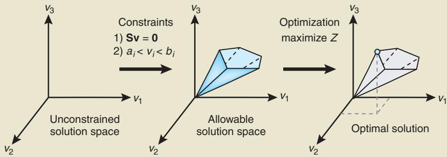
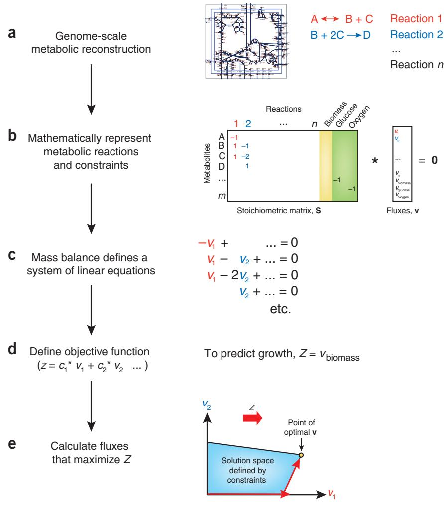

# What is flux balance analysis?

Jeffrey D Orth, Ines Thiele & Bernhard © Palsson

Flux balance analysis is a mathematical approach for analyzing the flow of metabolites through a metabolic network. This primer covers the theoretical basis of the approach, several practical examples and a software toolbox for performing the calculations.

"lux balance analysis (FBA) is a widely used approach for studying biochemical networks, in particular the genome-scale metabolic network reconstructions that have been built in the past decadel-4. These network reconstructions contain all of the known metabolic reactions in an organism and the genes that encode each enzyme. FBA calculates the flow of metabolites through this metabolic network, thereby making it possible to predict the growth rate of an organism or the rate of production of a biotechnologically important metabolite. With metabolic models for 35 organisms already available (http://systemsbiology.ucsd.edu/ In_Silico_Organisms/Other_Organisms) and high-throughput technologies enabling the construction of many more each year5-7, FBA is an important tool for harnessing the knowledge encoded in these models.

In this primer, we illustrate the principles behind FBA by applying it to predict the maximum growth rate of Escherichia coli in the presence and absence of oxygen. The principles outlined can be applied in many other contexts to analyze the phenotypes and capabilities of organisms with different environmental and genetic perturbations (a Supplementary Tutorial provides ten additional worked examples with figures and computer code).

# Flux balance analysis is based on constraints

The first step in FBA is to mathematically represent metabolic reactions (Box 1 and Fig. 1).

The core feature of this representation is a tabulation, in the form of a numerical matrix, of the stoichiometric coeffi cients of each reaction (Fig. 2a,b). These stoichiometries impose constraints on the flow of metabolites through the network. Constraints such as these lie at the heart of FBA, differentiating the approach from theory-based models dependent on biophysical equations that require many difficultto-measure kinetic parameters8,9.

Constraints are represented in two ways, as equations that balance reaction inputs and outputs and as inequalities that impose bounds on the system. The matrix of stoichiometries imposes flux (that is, mass) balance constraints on the system, ensuring that the total amount of any compound being produced must be equal to the total amount being consumed at steady state (Fig. 2c). Every reaction can also be given upper and lower bounds, which define the maximum and minimum allowable fluxes of the reactions. These balances and bounds define the space of allowable flux distributions of a system—that is, the rates at which every metabolite is consumed or produced by each reaction. Other constraints can also be added10.

# From constraints to optimizing a phenotype

The next step in FBA is to define a phenotype in the form of a biological objective that is relevant to the problem being studied (Fig. 2d). In the case of predicting growth, the objective is biomass production——that is, the rate at which metabolic compounds are converted into biomass constituents such as nucleic acids, proteins and lipids. Biomass production is mathematically represented by adding an artificial 'biomass reaction' that is, an extra column of coefficients in the matrix of stoichiometries—that consumes precursor metabolites at stoichiometries that simulate biomass production. The biomass reaction is based on experimental measurements of biomass components. This reaction is scaled so that the flux through it is equal to the exponential growth rate $( \mu )$ of the organism.

Now that biomass is represented in the model, predicting the maximum growth rate can be accomplished by calculating the conditions that result in the maximum flux through the biomass reaction. In other cases, more than one reaction may contribute to the phenotype of interest. Mathematically, an 'objective function' is used to quantitatively define how much each reaction contributes to the phenotype.

Taken together, the mathematical representations of the metabolic reactions and of the objective define a system of linear equations. In flux balance analysis, these equations are solved using linear programming (Fig. 2e). Many computational linear programming algorithms exist, and they can very quickly identify optimal solutions to large systems of equations. The COBRA Toolbox1 is a freely available Matlab toolbox for performing these calculations (Box 2).

Suppose we want to calculate the maximum aerobic growth of $E$ coli under the assumption that uptake of glucose, and not oxygen, is the limiting constraint on growth. This calculation can be performed using a published model of $E$ , coli metabolism12. In addition to metabolic reactions and the biomass reaction discussed above, this model also includes reactions that represent glucose and oxygen uptake into the cell. The assumptions are mathematically represented by setting the maximum rate of glucose uptake to a physiologically realistic level ( $1 8 . 5 \ \mathrm { m m o l }$

Metabolic reactions are represented as a stoichiometric matrix (S) of size $m \times n$ Every row of this matrix represents one unique compound (for a system with $m$ compounds) and every column represents one reaction( $\boldsymbol { { n } }$ reactions). The entries in each column are the stoichiometric coefficients of the metabolites participating in a reaction. There is a negative coefficient for every metabolite consumed and a positive coefficient for every metabolite that is produced. A stoichiometric coefficient of zero is used for every metabolite that does not participate in a particular reaction. S is a sparse matrix because most biochemical reactions involve only a few different metabolites. The flux through all of the reactions in a network is represented by the vector v, which has a length of $n$ . The concentrations of all metabolites are represented by the vector $\pmb { \chi }$ , with length $m$ . The system of mass balance equations at steady state ${ \left( { \mathsf { d } } { \boldsymbol { \mathsf { x } } } / { \mathsf { d } } t = \right. }$ O) is given in Fig. $\scriptstyle 2 c ^ { 2 6 }$

Any $\pmb { \nu }$ that satisfies this equation is said to be in the null space of s. In any realistic large-scale metabolic model, there are more reactions than there are compounds $( n > m )$ . In other words, there are more unknown variables than equations, so there is no unique solution to this system of equations.

Although constraints define a range of solutions, it is still possible to identify and glucose $\mathrm { 8 D W ^ { - 1 } h ^ { - 1 } }$ ; DW, dry weight) and setting the maximum rate of oxygen uptake to an arbitrarily high level, so that it does not limit growth. Then, linear programming is used to determine the maximum possible flux through the biomass reaction, resulting in a predicted exponential growth rate of $1 . 6 5 \mathrm { h } ^ { - 1 }$ . Anerobic growth of E. coli can be calculated by constraining the maximum rate of uptake of oxygen to zero and solving the system of equations, resulting in a predicted growth rate of $0 . 4 7 \mathrm { h } ^ { - 1 }$ (see Supplementary Tutorial for computer code).

As these two examples show, FBA can be used to perform simulations under different conditions by altering the constraints on a model. To change the environmental conditions (such as substrate availability), we change the bounds on exchange reactions (that is, reactions representing metabolites flowing into and out of the system). Substrates that are not available are analyze single points within the solution space. For example, we may be interested in identifying which point corresponds to the maximum growth rate or to maximum ATP production of an organism, given its particular set of constraints. FBA is one method for identifying such optimal points within a constrained space (Fig. 1).

  
Figure 1 The conceptual basis of constraint-based modeling. With no constraints, the flux distribution of a biological network may lie at any point in a solution space. When mass balance constraints imposed by the stoichiometric matrix S (labeled 1) and capacity constraints imposed by the lower and upper bounds $\cdot a _ { j }$ and $b _ { i }$ ) (labeled 2) are applied to a network, it defines an allowable solution space. The network may acquire any flux distribution within this space, but points outside this space are denied by the constraints. Through optimization of an objective function, FBA can identify a single optimal flux distribution that lies on the edge of the allowable solution space.

FBA seeks to maximize or minimize an objective function $Z = \mathbf { c } ^ { \mathsf { T } } \mathbf { y }$ , which can be any linear combination of fluxes, where c is a vector of weights indicating how much each reaction (such as the biomass reaction when simulating maximum growth) contributes to the objective

function. In practice, when only one reaction is desired for maximization or minimization, c is a vector of zeros with a value of 1 at the position of the reaction of interest (Fig. 2d).

constrained to an uptake rate of $0 \ \mathrm { m m o l }$ $\mathrm { 8 D W ^ { - 1 } h ^ { - 1 } }$ . Constraints can also be tailored to the organism being studied, with lower bounds of $0 \mathrm { m m o l g D W ^ { - 1 } h ^ { - 1 } }$ used to simulate reactions that are irreversible in some organisms. Nonzero lower bounds can also force a minimal flux through artificial reactions (like the biomass reaction) such as the 'ATP maintenance reaction', which is a balanced ATP hydrolysis reaction used to simulate energy demands not associated with growth13. Constraints can even be used to simulate gene knockouts by limiting reactions to zero flux.

Optimization of such a system is accomplished by linear programming (Fig. 2e). FBA can thus be defined as the use of linear programming to solve the equation $\mathsf { S } \mathsf { v } = 0$ , given a set of upper and lower bounds on $\pmb { \nu }$ and a linear combination of fluxes as an objective function. The output of FBA is a particular flux distribution, $\pmb { \nu }$ , which maximizes or minimizes the objective function.

FBA does not require kinetic parameters and can be computed very quickly even for large networks. This makes it well suited to studies that characterize many different perturbations such as different substrates or genetic manipulations. An example of such a case is given in example 6 in Supplementary Tutorial, which explores the effects on growth of deleting every pairwise combination of $1 3 6 E .$ coli genes to find double gene knockouts that are essential for survival of the bacteria.

FBA has limitations, however. Because it does not use kinetic parameters, it cannot predict metabolite concentrations. It is also only suitable for determining fluxes at steady state. Except in some modified forms, FBA does not account for regulatory effects such as activation of enzymes by protein kinases or regulation of gene expression. Therefore, its predictions may not always be accurate.

# The many uses of flux balance analysis

Because the fundamentals of fl ux balance analysis are simple, the method has found diverse uses in physiological studies, gap-filling efforts and genome-scale synthetic biology3. By altering the bounds on certain reactions, growth on different media (example 1 in Supplementary Tutorial) or of bacteria with multiple gene

Figure 2 Formulation of an FBA problem. (a) A metabolic network reconstruction consists of a list of stoichiometrically balanced biochemical reactions. (b) This reconstruction is converted into a mathematical model by forming a matrix (labeled S), in which each row represents a metabolite and each column represents a reaction. Growth is incorporated into the reconstruction with a biomass reaction (yellow column), which simulates metabolites consumed during biomass production. Exchange reactions (green columns) are used to represent the flow of metabolites, such as glucose and oxygen, in and out of the cell. (c) At steady state, the flux through each reaction is given by $\mathtt { S v } = 0$ which defines a system of linear equations. As large models contain more reactions than metabolites, there is more than one possible solution to these equations. (d) Solving the equations to predict the maximum growth rate requires defining an objective function $Z = \mathbf { c } ^ { \mathsf { T } } \mathbf { v }$ (c is a vector of weights indicating how much each reaction $( \pmb { \nu } )$ contributes to the objective). In practice, when only one reaction, such as biomass production, is desired for maximization or minimization, c is a vector of zeros with a value of 1 at the position of the reaction of interest. In the growth example, he objective function is $Z = \pmb { v }$ biomass (that is, c has a value of 1 at the position of the biomass reaction). (e) Linear programming is used to identify a flux distribution that maximizes or minimizes the objective function within the space of allowable fluxes (blue region) defined by the constraints imposed by the mass balance equations and reaction bounds. The thick red arrow indicates the direction of increasing Z. As the optimal solution point lies as far in this direction as possible, the thin red arrows depict the process of linear programming, which identifies an optimal point at an edge or corner of the solution space.

knockouts (example 6 in Supplementary Tutorial) can be simulated14. FBA can then be used to predict the yields of important cofactors such as ATP, NADH, or $\mathrm { N A D P H } ^ { 1 5 }$ (example 2 in Supplementary Tutorial).

Whereas the example described here yielded a single optimal growth phenotype, in large metabolic networks, it is often possible for more than one solution to lead to the same desired optimal growth rate. For example, an organism may have two redundant pathways that both generate the same amount of ATP, so either pathway could be used when maximum ATP production is the desired phenotype. Such alternate optimal solutions can be identified through flux variability analysis, a method that uses FBA to maximize and minimize every reaction in a network16 (example 3 in Supplementary Tutorial), or by using a mixed-integer linear programming–based algorithm17. More detailed phenotypic studies can be performed such as robustness analysis18, in which the effect on the objective function of varying a particular reaction flux can be analyzed (example 4 in Supplementary Tutorial).

A more advanced form of robustness analysis involves varying two fluxes simultaneously to form a phenotypic phase plane19 (example 5 in Supplementary Tutorial).

that predict which reactions are missing by comparing in silico growth simulations to experimental results20-22. Constraint-based models can also be used for metabolic engineering where FBA-based algorithms, such as OptKnock23, can predict gene knockouts that allow an organism to produce desirable compounds24,25.

All genome-scale metabolic reconstructions are incomplete, as they contain 'knowledge gaps' where reactions are missing. FBA is the basis for several algorithms

# Box 2 Tools for FBA

FBA computations, which fall into the category of constraint-based reconstruction and analysis (COBRA) methods, can be performed using several available tools27-29. The COBRA Toolbox11 is a freely available Matlab toolbox (http://systemsbiology.ucsd.edu/ Downloads/Cobra_Toolbox) that can be used to perform a variety of COBRA methods, including many FBA-based methods. Models for the COBRA Toolbox are saved in the Systems Biology Markup Language (SBML)30 format and can be loaded with the function 'readCbModel'. The E. coli core model used in this Primer is available at http://systemsbiology.ucsd.edu/Downloads/E_coli_Core/.

In Matlab, the models are structures with fields, such as 'rxns'(a list of all reaction names), 'mets' (a list of all metabolite names) and $" \mathbb { S } '$ (the stoichiometric matrix). The function 'optimizeCbModel' is used to perform FBA. To change the bounds on reactions, use the function 'changeRxnBounds'. The Supplementary Tutorial contains examples of COBRA toolbox code for performing FBA, as well as several additional types of constraint-based analysis.

Ultimately, FBA produces predictions that must be verified. Experimental studies are used as part of the model reconstruction process and to validate model predictions. Studies have shown that growth rates of $E$ coli on several different substrates predicted by FBA agree well with those obtained by experimental measurementsl4. Model-based predictions of gene essentiality have also been shown to be quite accurate2.

This primer and the accompanying tutorials based on the COBRA toolbox (Box 2) should help those interested in harnessing the growing cadre of genome-scale metabolic reconstructions that are becoming available.

# ACKNOWLEDGMENTS

This work was supported by National Institutes of Health grant no. R01 GM057089.

1. Duarte, N.C. et al. Proc. Natl. Acad. Sci. USA 104, 1777–1782 (2007). 2. Feist, A.M. et al. Mol. Syst. Biol. 3, 121 (2007). 3. Feist, A.M. & Palsson, B.O. Nat. Biotechnol. 26,

659–667 (2008).   
4. Oberhardt, M.A., Palsson, B.O. & Papin, J.A. Mol. Syst. Biol. 5, 320 (2009).   
5. Thiele, I. & Palsson, B.0. Nat. Protoc. 5, 93–121 (2010).   
6. Feist, A.M., Herrgard, M.J., Thiele, I., Reed, J.L. & Palsson, B.0. Nat. Rev. Microbiol. 7, 129–143 (2009).   
7. Durot, M., Bourguignon, P.Y. & Schachter, V. FEMS Microbiol. Rev. 33, 164–190 (2009).   
8. Covert, M.W. et al. Trends Biochem. Sci. 26, 179–   
186 (2001).   
9. Edwards, J.S., Covert, M. & Palsson, B. Environ. Microbiol. 4, 133–140 (2002).   
10. Price, N.D., Reed, J.L. & Palsson, B.O. Nat. Rev. Microbiol. 2, 886–897 (2004).   
11. Becker, S.A. et al. Nat. Protoc. 2, 727–738 (2007).   
12. Orth, J.D., Fleming, R.M. & Palsson, B.O. in EcoSal —Escherichia coli and Salmonella Cellular and Molecular Biology (ed. Karp, P.D.) (ASM Press, Washington, DC, 2009).   
13. Varma, A. & Palsson, B.0. Biotechnol. Bioeng. 45,   
69–79 (1995).   
14.Edwards, J.S., Ibarra, R.U. & Palsson, B.O. Nat. Biotechnol. 19, 125–130 (2001).   
15. Varma, A. & Palsson, B.0. J. Theor. Biol. 165, 477–   
502(1993).   
16. Mahadevan, R. & Schilling, C.H. Metab. Eng. 5,   
264–276 (2003).   
17. Lee, S., Phalakornkule, C., Domach, M.M. & Grossmann, I.E. Comput. Chem. Eng. 24, 711–716 (2000).   
18. Edwards, J.S. & Palsson, B.0. Biotechnol. Prog. 16, 927-939 (2000).   
19.Edwards, J.S., Ramakrishna, R. & Palsson, B.0. Biotechnol. Bioeng. 77, 27–36 (2002).   
20. Reed, J.L. et al. Proc. NatI. Acad. Sci. USA 103, 17480–17484 (2006).   
21. Kumar, V.S. & Maranas, C.D. PLoS Comput. Biol. 5, e1000308 (2009).   
22. Satish Kumar, V., Dasika, M.S. & Maranas, C.D. BMC Bioinformatics 8, 212 (2007).   
23. Burgard, A.P., Pharkya, P. & Maranas, C.D. Biotechnol. Bioeng. 84, 647–657 (2003).   
24.Feist, A.M. et al. Metab. Eng. published online, doi:10.1016/j.ymben.2009.10.003 (17 0ctober 2009).   
25. Park, J.M., Kim, T.Y. & Lee, S.Y. Biotechnol. Adv. 27, 979–988 (2009).   
26.Palsson, B.0. Systems Biology: Properties of Reconstructed Networks (Cambridge University Press, New York, 2006).   
27.Jung, T.S., Yeo, H.C., Reddy, S.G., Cho, W.S. & Lee, D.Y. Bioinformatics 25, 2850–2852 (2009).   
28. Klamt, S., Saez-Rodriguez, J. & Gilles, E.D. BMC Syst. Bio1. 1, 2 (2007).   
29. Lee, D.Y., Yun, H., Park, S. & Lee, S.Y. Bioinformatics 19, 2144–2146 (2003).   
30.Hucka, M. et al. Bioinformatics 19, 524–531 (2003).